# Abstract

## 1 Introduction

### Description

### 1.1 Dataset:

In this project, our goal is to understand how various conditions affect the usage of public bicycle sharing system. We picked London area as the observing site. The main data came from two datasets on Kaggle, titled "London and Taipei Bike-Share Data" and "London bike sharing dataset." 

#### 1.1.1 London and Taipei Bike-Share Data

This dataset contains every single bike rental transaction in a total of 802 bike-sharing stops in the London area from 2017 until the Covid outbreak. Each transaction provides the following information:

Table 1: Description of London.csv

| Object | Description |
| --- | --- |
| rental_id | id of people who rent the bike |
| duration | duration of rental |
| bike_id  | id of bike |
| end_rental_date_time | date and time of end rental |
| end_station_id | id of end station |
| end_station_name | name of end station |
| start_rental_date_time | date and time of start rental |
| start_station_id | id of end station |
| start_station_name | name of start station |
| start_rental_date_time | date and time of start rental |

#### 1.1.2 London bike sharing dataset

This dataset shows how many bike-sharing transactions took place in each hour in 2015 to 2016. Comparing to the first dataset, this one is more compact since it does not contain individual information. However, it helped providing information on weather conditions. Although the timespan doesn't overlap with the first dataset, it encourages us to find timespan-matching weather data to help with further analysis.

Table 2: Description of London_merged.csv

| Object | Description |
| --- | --- |
| timestamp  | timestamp field for grouping the data |
| cnt | the count of a new bike shares |
| t1 | real temperature in Celsius |
| t2 | apparent temperature in Celsius |
| hum | humidity in percentage |
| windspeed | wind speed in km/h |
| isholiday | boolean field - 1 holiday / 0 non holiday - refers to bank holidays |
| isweekend | boolean field - 1 if the day is weekend / 0 if a working day |
| season | category (0-spring; 1-summer; 2-autumn; 3-winter) |
| weathercode | different weather condition|

Table 3: Description of weathercode

| weathercode | Description |
| --- | --- |
| 1 | clear; mostly clear but have some values with haze/fog|
| 2 | scattered clouds / few clouds|
| 3 | broken clouds|
| 4 | clear; cloudy|
| 7 | clear; light rain shower / rain / light rain|
| 10 | clear; rain with thunderstorm|
| 26 | snowfall|
| 90 | freezing fog |

In addition to season and isweekend, from the timestamp feature we can extract many separate time features - day of the week (as one scaled column or as seven columns of ismonday, istuesday etc.), month number, day of the month, week number, hour, minute. In combination with external data, we could add is_light for after dawn times and is_schoolholiday to match London school holiday times.

#### 1.1.3 Link of dataset:

[London and Taipei bikeshare](https://www.kaggle.com/datasets/ajohrn/bikeshare-usage-in-london-and-taipei-network)

[London bikeshare](https://www.kaggle.com/datasets/hmavrodiev/london-bike-sharing-dataset/discussion?resource=download)

### 1.2 Proposal

Recently, bike-sharing in big cities has become an important part of residents' daily life, and its role in urban transportation system has never been more significant. Looking at the spatiotemporal bike-sharing data in London, we could explore patterns, describe variations, or model the data in many different ways. From the two datasets, we may have a chance to take a peek at the residents' bike-renting behavior through many angles.

Previous work has shown that weather is a key driver for variation in usage. [1] [2] Aside from weather, We believe there are a lot more important factors such as peak/off-peak hours, weekday/weekend, bike-stop location etc. By utilizing these datasets, we hope to find as many correlations between the users behavior and various factors. 

We plan to start by looking at the trends. How does weather or other factors affect the London area overall? Although the answer could be found in both datasets, the structure of the second dataset(see 1.1.2 London bike sharing dataset) would make the job easier if we were only looking at big trends. Then we would look at the microscopic data provided by the first dataset(1.1.1 London and Taipei Bike-Share Data), and hope it would support our claims.

Lastly, after each correlation is explored, we will try to formulate a model that would help us predict the hourly bike-sharing usage in the stops. Our objective is to give a usage forecast in order to help users manage their travel time, and for service providers to better dispatch bikes to maintain service quality.

## 2 Exploratory Data Analysis

In this section, we look at different factors affecting the usage of the bike sharing system in London. Each factors that we are interested is plotted along with the average usage per hour. Then we look for micro trends in specific bike-stop that contradicts with the big trends we found.

### 2.1 Data Wrangling

#### 2.1.1 Data cleaning process

Both of the csv files needed to be restructured in some ways before the analyzing process. For instance, the exact time is stored as strings: 

"2015/1/4  12:00:00 AM"

Information such as date and time could be extracted from within. The somehow trickier part is the day-of-the-week. We add a certain number to the date and take the remainder after divided by 7 to get the day-of-the-week.

### 2.2 Analysis and Visualization

#### Large trends

In this section, we look at how different factors affect the average usage per hour in 2015-2016. 
****
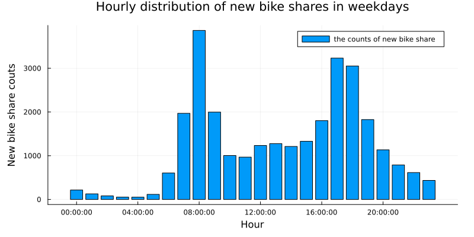

**Figure1: Average hourly usage on weekdays**

This figure shows how average bike-sharing usage distribute in different hours in a weekday. In the image, one could easily spot a double-peaked distribution. This comes with no surprise - the rush hour in weekdays generates a lot of commuting demands, and apparently people turn to bike-sharing in these hours. On average, over three thousand people rented a bike at 08:30 everyday, the busiest time in terms of bike-sharing usage.
****
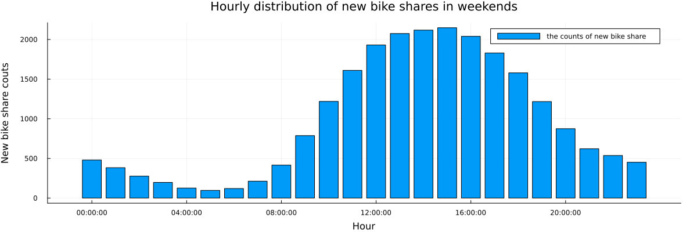

**Figure2: Average hourly usage on weekends**

This figure shows how the new bike share demand distribute in different hours in weekends. Base on the image, we can speculate that Londoners are most active between 11:00 and 19:00 on weekends. 
****
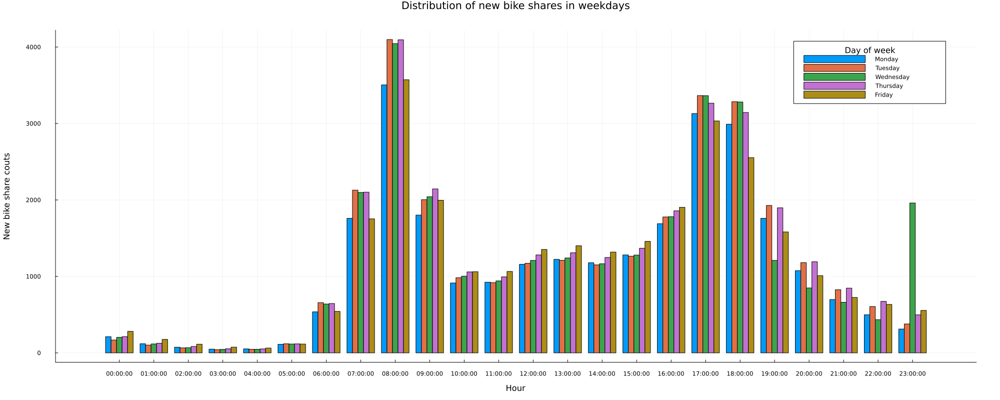

**Figure3: Average hourly usage between different weekdays**

This figure generally agrees with Figure1. During rush hours, bike-sharing usage climates. There are not many conclusions to make according to this figure, except that usage characteristics are mostly the same during Tuesday to Thursday. Consider a two-working-day span that lies in Tuesday to Thursday, with nearly identical weather conditions, we could speculate that these two days would have similar bike-sharing usage. Mondays and Fridays on the other hand, are seen to have slight difference to their weekday counterparts. 
****
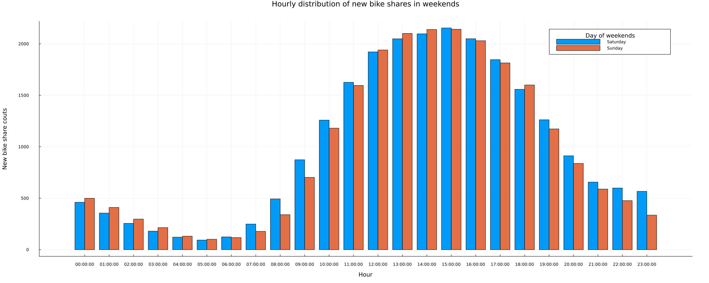

**Figure4: Average hourly usage between different days in the weekend**

The figure shows that the overall difference of new bike share between the two days of the weekend is not big except one logical difference: since Monday is a working day, Sunday's usage at night can be seen to be smaller than Saturday.
****
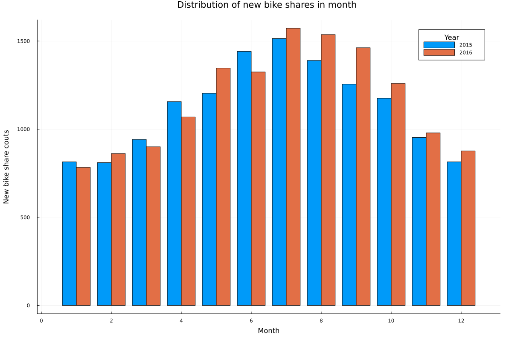

**Figure5: Average hourly usage between different months**

In this figure, the hourly trend is still similar to that in figure1. Meaning in a given day regardless of the month, rush hour still generates the most bike-share usage. However, large differences between months could be spotted, especially between the April to October period and the November to March period. We can easily come to a conclusion that users are less willing to ride a bike in the cold.

****
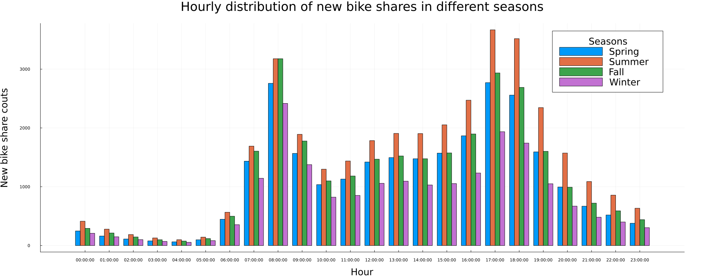

**Figure8: mean cnt of each season with the distribution of hour**
****
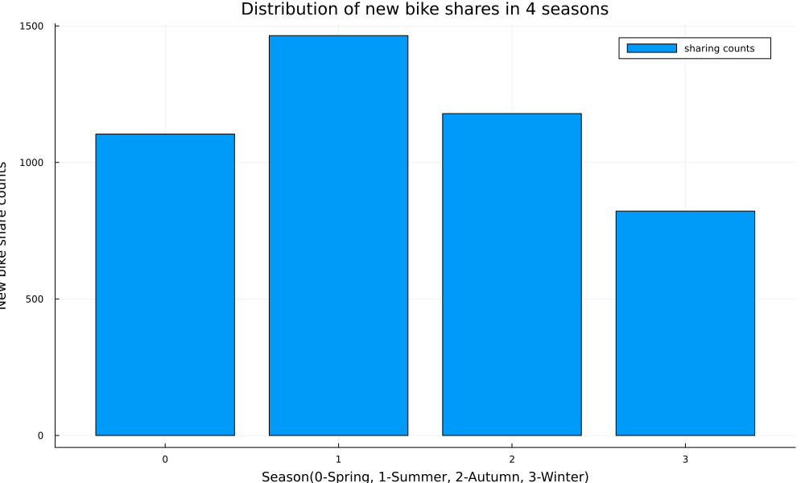

**Figure9: mean cnt of each season**

According to these two images, it can be seen that the demand for new bike share in London is relatively higher in summer and autumn overall, especially in summer. Winter is undoubtedly the lowest, but in this image it can be seen that the demand for new bike share is lower in spring than in autumn. It can be guessed that people are more willing to take bike share in the season of relatively higher temperature, and autumn is more suitable for bike share than spring in London area. In addition, people's bike share during the off-duty peak period is significantly higher during summer than not only during other seasons, but also during their off-duty peak period, a scenario that differs from all the weekday-related images described above.
****
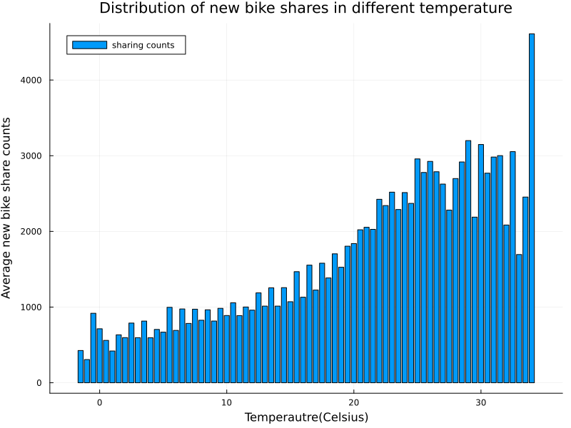

**Figure10: mean cnt of each temperature**

This image shows the change of new bike share in different temperaure. The number of sharing bikes increases with temperature totally. The minimum result is below zero Celsius degree and the maximum one is more than 30 Celsius degrees. However, this trend is not a strictly positive correlation. If the highest value in the plot is neglected, it can be found that the average counts comes down after the temperature is more than about 30 Celsius dergees. 
****
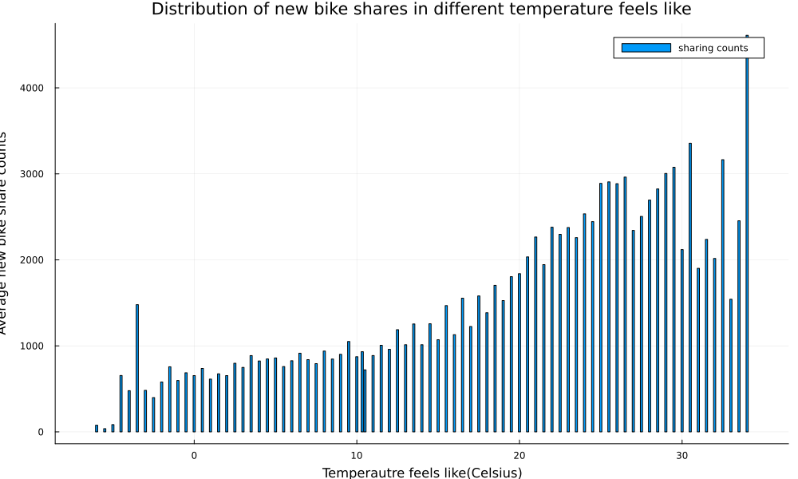

**Figure11: mean cnt of each temperature "feels like"**

As the dataframe offers both the data of temperature and temperature "feels like", it is possible to compare the impact of apparent temperature. The lowest and highest apparent temperature affect more on the bike sharing counts, comparing to the real temparature. It can be concluded that users are less willing to choose riding when the temperature is too high or too low. 
****
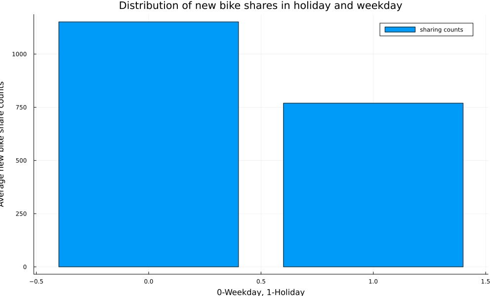

**Figure12: mean cnt of holidays and weekdays**

This figure consists of holidays and weekdays. It is obviously that the weekdays has about one third higher average bike sharing counts than holidays, which proves that users choose the sharing bike more frequently on weekdays.

**Figure13: pie chart of distribution under 7 weather conditions**

This pie chart clearly reveals the percentage of people utilizing bike sharing system. Basically, when the weather is good, people tend to utilize the bike sharing system more often, which is easy to understand. But after deeper investigations, evidences show that there is not a huge difference between "cloudy", "light rain" and "thunderstorm". It can be interpreted as when it is cloudy, people tend to feel a little bit reluctant to go outing compared with those warm and sunny days. But when those pedestrians are caught in the rain with no access to a car, they tend to have the thought of going home quickly. In this case, many of them would choose to ride a bike no matter it is "light rain" or "thunderstorm".
****
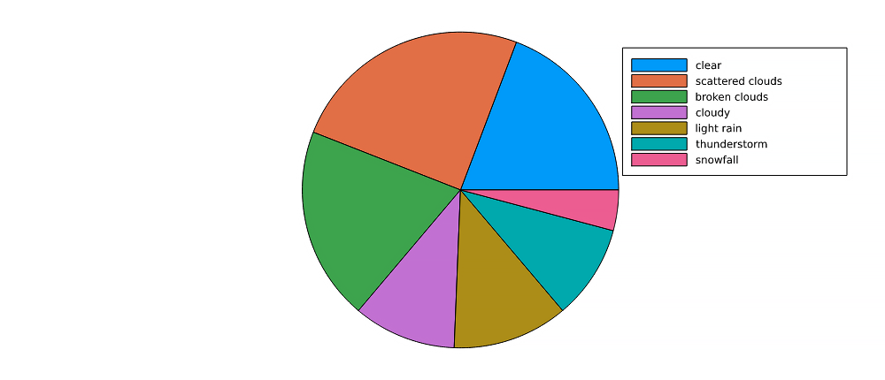

**Figure14: mean cnt of distribution under 7 weather conditions during weekdays and weekends per hour**

This groupedbar chart shows the mean of people utilizing bike sharing system during weekdays and weekends. Most of the time, people tend to utilize bike sharing system more often during weekdays. However, when it comes to "cloudy" and "thunderstorm", people who ride shared bikes in the weekends are slightly more than that in the weekdays. It can be interpreted that when it is cloudy during weekdays, people may choose cars or buses to avoid potential rains. But when it comes to weekends, people tend to cherish every chance to go outing, even is has the posibility to rain , resulting in an increase in shared bike usage. But when it is snowing, it becomes extremely hard to go outing, there is a dramatic decrease in bike usage.
****
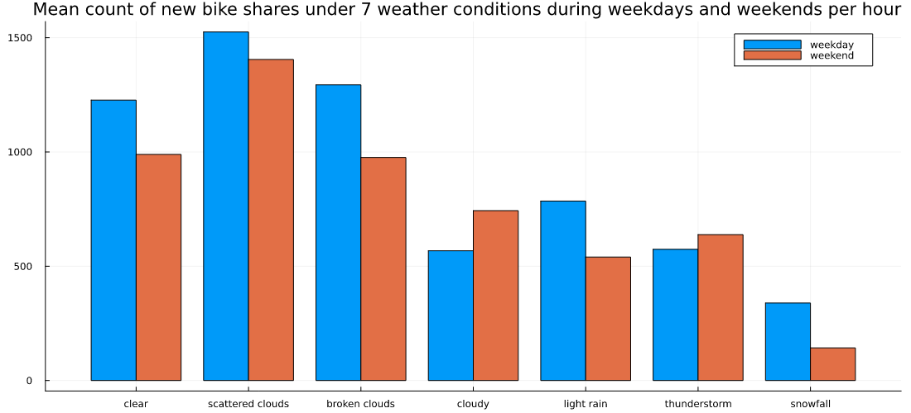

## Predictive Modeling

