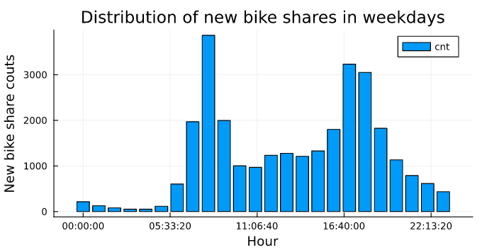
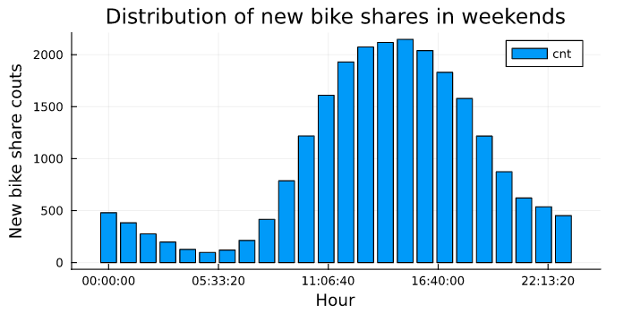
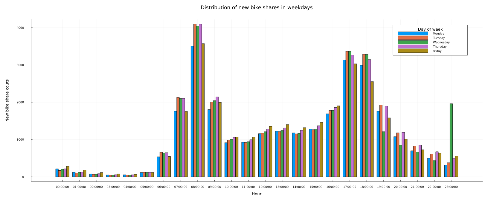
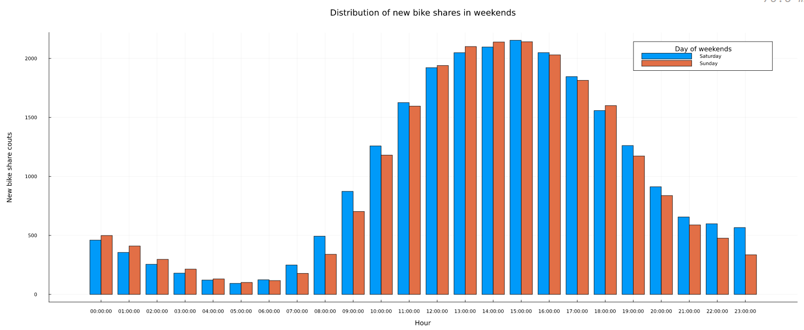
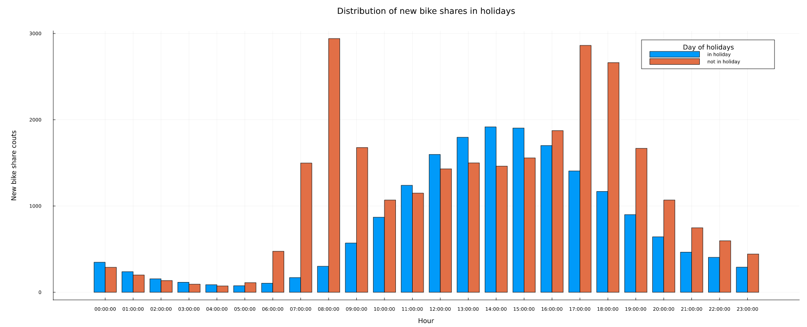
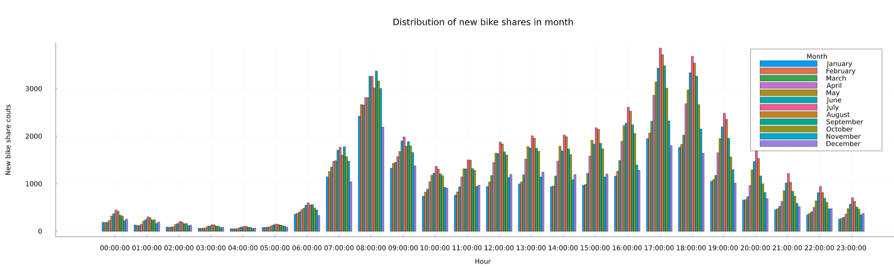
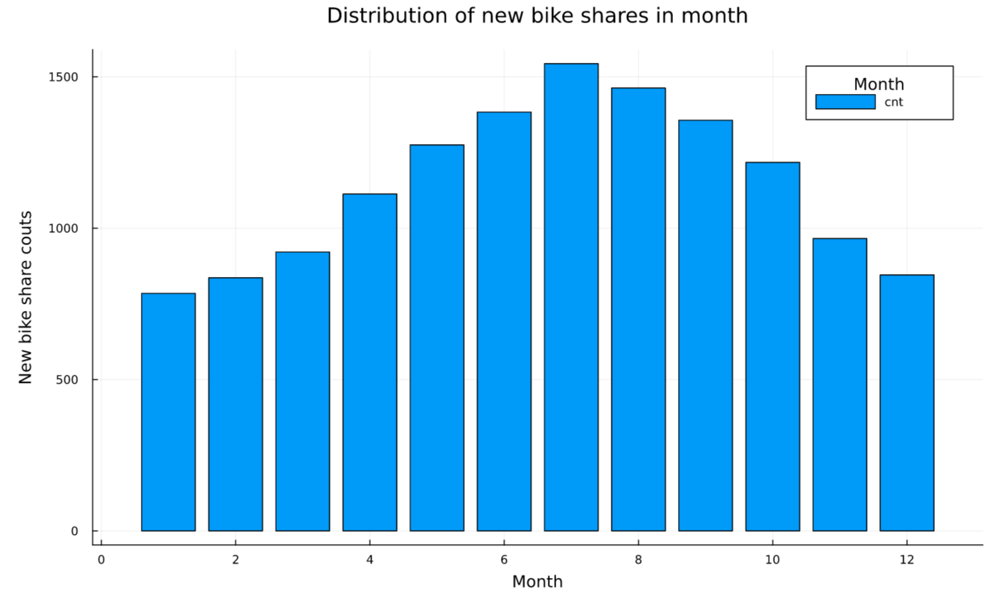
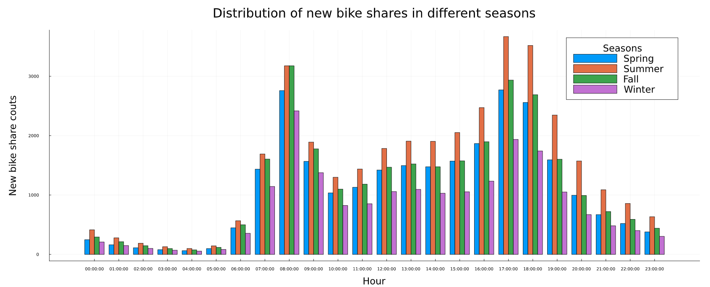

# Abstract

## Introduction

### Description

#### Dataset:

For this project, we are going to focus on the usage of bike sharing in London. The data come from two datasets, "London and Taipei Bike-Share Data" and "London bike sharing dataset." 

#### London and Taipei Bike-Share Data

The raw data is collected from the respective cities open data sites. 

[London](https://cycling.data.tfl.gov.uk/) 

The data has been reformatted into CSV in order to be easier to use and compare. The content remains unchanged. 

This dataset would be the main dataset for the project as it contains every single bike rental in London in the duration. This gives the columns in the data comprise:

Table 1: Discription of London and Taipei Bike-Share

| Object | Description |
| --- | --- |
| rental_id | id of people who rent the bike |
| duration | duration of rental |
| bike_id  | id of bike |
| end_rental_date_time | date and time of end rental |
| end_station_id | id of end station |
| end_station_name | name of end station |
| start_rental_date_time | date and time of start rental |
| start_station_id | id of end station |
| start_station_name | name of start station |
| start_rental_date_time | date and time of start rental |

#### London bike sharing dataset

This dataset is playing a more supporting role, as it helped providing informations on weather conditions. Although the timespan doesn't overlap too much with the first dataset (January 4th 2015 to January 3rd 2017), it gives the idea to incorporate weather conditions into consideration. In the future we may try to find weather datasets that fit the first dataset better to help analyzing.

The data has been formatted into CSV in order to be easier to use and compare. This gives The columns in the data comprise:

Table 2: Description of London Bike-Share

| Object | Description |
| --- | --- |
| timestamp  | timestamp field for grouping the data |
| cnt | the count of a new bike shares |
| t1 | real temperature in Celsius |
| t2 | temperature in Celsius "feels like" |
| hum | humidity in percentage |
| windspeed | wind speed in km/h |
| isholiday | boolean field - 1 holiday / 0 non holiday - refers to bank holidays |
| isweekend | boolean field - 1 if the day is weekend / 0 if a working day |
| season | category (0-spring; 1-summer; 2-autumn; 3-winter) |
| weathercode | different weather condition|

Table 3: Description of weathercode

| weathercode | Description |
| --- | --- |
| 1 | clear; mostly clear but have some values with haze/fog|
| 2 | scattered clouds / few clouds|
| 3 | broken clouds|
| 4 | clear; cloudy|
| 7 | clear; light rain shower / rain / light rain|
| 10 | clear; rain with thunderstorm|
| 26 | snowfall|
| 90 | freezing fog |

In addition to season and isweekend, from the timestamp feature we can extract many separate time features - day of the week (as one scaled column or as seven columns of ismonday, istuesday etc.), month number, day of the month, week number, hour, minute. In combination with external data, we could add is_light for after dawn times and is_schoolholiday to match London school holiday times.

#### Link of dataset:

[London and Taipei bikeshare](https://www.kaggle.com/datasets/ajohrn/bikeshare-usage-in-london-and-taipei-network)

[London bikeshare](https://www.kaggle.com/datasets/hmavrodiev/london-bike-sharing-dataset/discussion?resource=download)

## Proposal "SPECIFIC"

Recently, bike-sharing in big cities has become an important part of residents' daily life, and its role in urban transportation system has never been more significant. Looking at the spatiotemporal bike-sharing data in London, we could explore patterns, describe variations, or model the data in many different ways. From the two datasets, we may have a chance to take a peek at the residents' bike-renting behavior through many angles.

"PREVIOUS" work has shown that weather is a key driver for variation in usage. [1] [2] By utilizing those datasets to analyze how extreme weather events like winter rains in London will affect bike-sharing system, it is safe to draw some conclusions to guide the process of making contingency plans. The locations of start-trip and end-trip is also considered to have the potential of revealing hot spots of bike-renting usage.

The result will be able to offer some suggestions for the decision maker of bike-sharing companies about the arrangement of bike density in different blocks, distribution between urban and rural areas and methods to tackle extreme weather conditions.

## Exploratory Data Analysis

In this section,  most of factors attaches a bar chart indicating the distribution of the new bike share in London area and Taipei area. In order to achieve the goals of this project to analysis the influencial factors on the new bike share distribution, applying the process of Exploratory Data Analysis (EDA) is the way to develop the better understanding of this datasets and promote this project.

**(Hoping there will be more discription and introduction)**

### Data Wrangling

**(delete me if u think there is no need for more discription, But for me, I guess there could have some intro or description... )**

#### Different factors on the count of new bike shares

There are different factors in the database such as time, windspeed, season, and so on. The group is interested in these arguments and try to find the impact of them on the count of new bike shares(cnt).

**Data cleaning process**

The csv file with the London bike sharing dataset stored in is generic and need to be restructured before it can be used to anlysis its raw forms which are those variable connecting to factors influencing the number of new bike shares and its distribution.

For the dataset of London Bike Share, it contains 17414 variables (columns) and 10 factors in its original form. Due to the factor called timestamp in original form is hard to analysis the bike share distribution with time.So shift it into five more specific factors into its final form. Factors went from 10 to 14 which as shown in the Table 4. Besides, to fully analysis the distribution of bike share happened in London, using the final form of datasets to arrange 7 subtables using for analysis and visualization.

Table 4: Description of New London Bike-Share form

| Object | Description |
| --- | --- |
| cnt | the count of a new bike shares |
| t1 | real temperature in Celsius |
| t2 | temperature in Celsius "feels like" |
| hum | humidity in percentage |
| windspeed | wind speed in km/h |
| weathercode | different weather condition|
| isholiday | boolean field - 1 holiday / 0 non holiday - refers to bank holidays |
| isweekend | boolean field - 1 if the day is weekend / 0 if a working day |
| season | category (0-spring; 1-summer; 2-autumn; 3-winter) |
| date | the date of the bike share happens in the data form of Dates |
| year | the year of the bike share happens in the data form of Int |
| hour | the specific time to be observed of the bike share happens in the data form of Time |
| dayofweek | distiguis the date of the bike share happens in the day of the week |
| month| the month of the bike share happens in the data form of Int |

**(delete me except u think those below subtables is useful for our documents content, as they print here is to help teamates have better understanding of this documents)**

mean cnt of general weekdays with the distribution of hour

mean cnt of general weekends with the distribution of hour

mean cnt of day of week in weekdays with the distribution of hour

mean cnt of day of week in weekends with the distribution of hour

mean cnt of wether in holidays with the distribution of hour

mean cnt of different month with the distribution of hour

mean cnt with the distribution of season

**(delete me except u think those above subtables is useful for our documents content, as they print here is to help teamates have better understanding of this documents)**

### Analysis and Visualization

#### London Bike Share

In this section, adapt mean cnt (the count of a new bike shares) to analysis how the new bike share demand as this mean cnt could better present the demand levels as possible.

**Figure1: mean cnt of general weekdays with the distribution of hour**

This figure shows how the new bike share demand distribute in different hours in a weekday. According to the image, it can be clearly concluded that during the working day, the change of demand for borrowed cars shows a double-peaked image during the day, and the peak period of commuting can greatly affect the number of new borrowed cars, and the maximum peak of borrowed cars in a day appears around 8:30 which is higher than3000, and the minimum peak appears around 3:30 which is alomost 0.

**Figure2: mean cnt of general weekends with the distribution of hour**

This figure shows how the new bike share demand distribute in different hours in a weekend day. Based on the images, it is clear that during the weekend, the demand for rental cars varies in a single wave throughout the day, with the demand for travel in London mainly between 11:00 and 20:00, peaking around 15:00 and reaching a 

**Figure3: mean cnt of day of week in weekdays with the distribution of hour**

In this figure, y1, y2, y3, y4 and y5 represent Monday, Tuesday, Wednesday, Thursday and Friday, respectively.In this figure, the overall trend is consistent with the trend in Figure1, but according to this figure, we can conclude that the overall number of new bike shares on Monday and Friday is relatively low in each time period. It is worth noting that while the maximum peak in Figure1 is greater than 3000 but less than 4000, in this figure Tuesday, Wednesday and Thursday not only reach 4000, but also Tuesday and Thursday are the two days with higher relative quantities. In addition, the number of new bike shares is extraordinarily high at 22:00 on Wednesday, which is not only different from the trend in Figure1, but even almost three times higher than on other weekdays at the same moment.

**Figure4: mean cnt of day of week in weekends with the distribution of hour**

In this figure, y1 and y2 represent Saturday and Sunday, respectively. The figure shows that the overall difference of new bike share between the two days of the weekend is not big, but the new bike share from 6:00 to 15:00 on Saturday is higher than that on weekdays. This phenomenon shows that although people's demand for bike share in London is roughly the same on both days of the weekend, people's travel demand is higher during the daytime on Saturday.

**Figure5: mean cnt of in holidays with the distribution of hour**

In this figure, y1 represents the change in the number of new bike shares during the holiday period, while y2 represents the change in the number of new bike shares not during the holiday period. In this figure, it can be found that the change in the distribution of people's new bike share during holidays is similar to the image of the change in the distribution of people's new bike share on weekends in Figure 2, and those not during holidays are similar to the image of the change in the distribution of people's new bike share on weekdays in Figure 1. In addition, the number of people's new bike shares in London during holidays is higher than that of weekdays during midday and late afternoon. This indicates that during weekdays, people's bike share demand is influenced by work commuting, i.e., it reaches a double peak during the peak commuting period; while during holidays, people's bike share demand peaks at noon and after noon, and even during noon (mealtime) is higher than that during weekdays, which can be guessed that people tend to go out for gathering during noon on holidays.

**Figure6: mean cnt of each month with the distribution of hour**

In this figure, the overall distribution trend is similar to that in figure1 (hour-by-hour new bike share distribution over the workday), with large differences between months, especially between the April to October period and the November to March period. In addition, it can be seen that in the first half of the year, the overall demand for new bike share from 6:00 to 17:00 in London is higher than the level in the second half of the year.

**Figure7: mean cnt with the distribution of different month**

According to this figure, it can be seen that among all time periods, the new bike share is relatively high from April to October, especially from June to August.

**Figure8: mean cnt of each season with the distribution of hour**

**Figure9: mean cnt of each season**

According to these two images, it can be seen that the demand for new bike share in London is relatively higher in summer and autumn overall, especially in summer. Winter is undoubtedly the lowest, but in this image it can be seen that the demand for new bike share is lower in spring than in autumn. It can be guessed that people are more willing to take bike share in the season of relatively higher temperature, and autumn is more suitable for bike share than spring in London area. In addition, people's bike share during the off-duty peak period is significantly higher during summer than not only during other seasons, but also during their off-duty peak period, a scenario that differs from all the weekday-related images described above.

**Figure10: mean cnt of each temperature**

This image shows the change of new bike share in different temperaure. The number of sharing bikes increases with temperature totally. The minimum result is below zero Celsius degree and the maximum one is more than 30 Celsius degrees. However, this trend is not a strictly positive correlation. If the highest value in the plot is neglected, it can be found that the average counts comes down after the temperature is more than about 30 Celsius dergees. 

**Figure11: mean cnt of each temperature "feels like"**

As the dataframe offers both the data of temperature and temperature "feels like", it is possible to compare the impact of apparent temperature. The lowest and highest apparent temperature affect more on the bike sharing counts, comparing to the real temparature. It can be concluded that users are less willing to choose riding when the temperature is too high or too low. 

**Figure12: mean cnt of holidays and weekdays**

This figure consists of holidays and weekdays. It is obviously that the weekdays has about one third higher average bike sharing counts than holidays, which proves that users choose the sharing bike more frequently on weekdays.

## Predictive Modeling

