---
title: Bike-Share Usage in London Network Analysis
keywords:
- markdown
- publishing
- manubot
lang: en-US
date-meta: '2022-12-09'
author-meta:
- Mulin Wan
- Jingwen Yao
- Yunze Guo
- Bo-Yang Wang
header-includes: |-
  <!--
  Manubot generated metadata rendered from header-includes-template.html.
  Suggest improvements at https://github.com/manubot/manubot/blob/main/manubot/process/header-includes-template.html
  -->
  <meta name="dc.format" content="text/html" />
  <meta name="dc.title" content="Bike-Share Usage in London Network Analysis" />
  <meta name="citation_title" content="Bike-Share Usage in London Network Analysis" />
  <meta property="og:title" content="Bike-Share Usage in London Network Analysis" />
  <meta property="twitter:title" content="Bike-Share Usage in London Network Analysis" />
  <meta name="dc.date" content="2022-12-09" />
  <meta name="citation_publication_date" content="2022-12-09" />
  <meta name="dc.language" content="en-US" />
  <meta name="citation_language" content="en-US" />
  <meta name="dc.relation.ispartof" content="Manubot" />
  <meta name="dc.publisher" content="Manubot" />
  <meta name="citation_journal_title" content="Manubot" />
  <meta name="citation_technical_report_institution" content="Manubot" />
  <meta name="citation_author" content="Mulin Wan" />
  <meta name="citation_author_institution" content="CEE, University of Illinois Urbana-Champaign" />
  <meta name="citation_author" content="Jingwen Yao" />
  <meta name="citation_author_institution" content="CEE, University of Illinois Urbana-Champaign" />
  <meta name="twitter:creator" content="@Yaojune" />
  <meta name="citation_author" content="Yunze Guo" />
  <meta name="citation_author_institution" content="CEE, University of Illinois Urbana-Champaign" />
  <meta name="citation_author" content="Bo-Yang Wang" />
  <meta name="citation_author_institution" content="CEE, University of Illinois Urbana-Champaign" />
  <link rel="canonical" href="https://uiceds.github.io/cee-492-term-project-fall-2022-jiaotonguniv/" />
  <meta property="og:url" content="https://uiceds.github.io/cee-492-term-project-fall-2022-jiaotonguniv/" />
  <meta property="twitter:url" content="https://uiceds.github.io/cee-492-term-project-fall-2022-jiaotonguniv/" />
  <meta name="citation_fulltext_html_url" content="https://uiceds.github.io/cee-492-term-project-fall-2022-jiaotonguniv/" />
  <meta name="citation_pdf_url" content="https://uiceds.github.io/cee-492-term-project-fall-2022-jiaotonguniv/manuscript.pdf" />
  <link rel="alternate" type="application/pdf" href="https://uiceds.github.io/cee-492-term-project-fall-2022-jiaotonguniv/manuscript.pdf" />
  <link rel="alternate" type="text/html" href="https://uiceds.github.io/cee-492-term-project-fall-2022-jiaotonguniv/v/0c885dda19ada38d77a843b2040e5a831dff0a19/" />
  <meta name="manubot_html_url_versioned" content="https://uiceds.github.io/cee-492-term-project-fall-2022-jiaotonguniv/v/0c885dda19ada38d77a843b2040e5a831dff0a19/" />
  <meta name="manubot_pdf_url_versioned" content="https://uiceds.github.io/cee-492-term-project-fall-2022-jiaotonguniv/v/0c885dda19ada38d77a843b2040e5a831dff0a19/manuscript.pdf" />
  <meta property="og:type" content="article" />
  <meta property="twitter:card" content="summary_large_image" />
  <link rel="icon" type="image/png" sizes="192x192" href="https://manubot.org/favicon-192x192.png" />
  <link rel="mask-icon" href="https://manubot.org/safari-pinned-tab.svg" color="#ad1457" />
  <meta name="theme-color" content="#ad1457" />
  <!-- end Manubot generated metadata -->
bibliography:
- content/manual-references.json
manubot-output-bibliography: output/references.json
manubot-output-citekeys: output/citations.tsv
manubot-requests-cache-path: ci/cache/requests-cache
manubot-clear-requests-cache: false
...

<small><em>
This manuscript
([permalink](https://uiceds.github.io/cee-492-term-project-fall-2022-jiaotonguniv/v/0c885dda19ada38d77a843b2040e5a831dff0a19/))
was automatically generated
from [uiceds/cee-492-term-project-fall-2022-jiaotonguniv@0c885dd](https://github.com/uiceds/cee-492-term-project-fall-2022-jiaotonguniv/tree/0c885dda19ada38d77a843b2040e5a831dff0a19)
on December 9, 2022.
</em></small>

## Authors

+ **Mulin Wan** 
    · {.inline_icon}
    [mulin-wan](https://github.com/mulin-wan) 
  <small>
     CEE, University of Illinois Urbana-Champaign
  </small>

+ **Jingwen Yao** 
    · {.inline_icon}
    [jingwenyaooo](https://github.com/jingwenyaooo)
    · {.inline_icon}
    [Yaojune](https://twitter.com/Yaojune) 
  <small>
     CEE, University of Illinois Urbana-Champaign
  </small>

+ **Yunze Guo** 
    · {.inline_icon}
    [cyfcx2](https://github.com/cyfcx2) 
  <small>
     CEE, University of Illinois Urbana-Champaign
  </small>

+ **Bo-Yang Wang** 
    · {.inline_icon}
    [byw-5](https://github.com/byw-5) 
  <small>
     CEE, University of Illinois Urbana-Champaign
  </small>

# Abstract

## 1 Introduction

### 1.1 Proposal

Recently, bike-sharing in big cities has become an important part of residents' daily life, and its role in urban transportation system has never been more significant. By making bicycles available for short-distance excursions in metropolitan areas, governments hope that traffic, noise, and air pollution could reduce as the usage of motorized vehicles decreased. However, it takes great effort to maintain a well-functioned bike sharing system. To ensure that citizens could have constant access to the bikes, predicting the usage and dispatching bikes across different stops become crucial since one can easily imagine that usage would vary across different time and space. There are a lot of machine learning projects done on predicting total bike share usage in an entire city, this research plans to build on that and try to develop a usage predicting model on a single-stop scale, which is relatively rare at the moment.

We choose London as the area to work on. Looking at the spatiotemporal bike-sharing data in London, we could explore patterns, describe variations, or model the data in many different ways. From the two data sets, we may have a chance to take a peek at the residents' bike-renting behavior through many angles. Previous work has shown that weather is a key driver for variation in usage. [1][2][3] Aside from weather, We believe there are a lot more important factors such as peak/off-peak hours, weekday/weekend, bike-stop location etc. By utilizing these data sets, we hope to find as many correlations between the users behavior and various factors. Also, since we are working on data collected before the outbreak of the COVID-19, we assume that peoples' behavior shown in the datasets are still valid now. The datasets would be introduced in the following sections, including why do we choose them and how we are going to implement them in our research.

### 1.2 Data set:

The two main datasets were downloaded from Kaggle, titled "London bike sharing data set" and "London and Taipei Bike-Share Data." 

#### 1.2.1 London bike sharing data set

This dataset shows how many bike-sharing transactions took place in the entire London area each hour in 2015 to 2016. Because the usage in this dataset is the summation across all the stops in the city, we could have a more general feel of how major variables such as weather conditions and time affect bike share usage, excluding the effect of the location of the stop on its usage. (This dataset will be hereinafter referred to as the first dataset.)

**Table 1: Description of London_merged.csv**

| Object | Description |
| --- | --- |
| timestamp  | timestamp field for grouping the data |
| cnt | the count of a bike sharing |
| t1 | real temperature in Celsius |
| t2 | apparent temperature in Celsius |
| hum | humidity in percentage |
| windspeed | wind speed in km/h |
| isholiday | boolean field - 1 holiday / 0 non holiday - refers to bank holidays |
| isweekend | boolean field - 1 if the day is weekend / 0 if a working day |
| season | category (0-spring; 1-summer; 2-autumn; 3-winter) |
| weathercode | different weather condition|

**Table 2: Description of weathercode**

| weathercode | Description |
| --- | --- |
| 1 | clear; mostly clear but have some values with haze/fog|
| 2 | scattered clouds / few clouds|
| 3 | broken clouds|
| 4 | clear; cloudy|
| 7 | clear; light rain shower / rain / light rain|
| 10 | clear; rain with thunderstorm|
| 26 | snowfall|
| 90 | freezing fog |

#### 1.2.2 London and Taipei Bike-Share Data

This data set contains every single bike rental transaction in a total of 802 bike-sharing stops in the London area from 2017 until the COVID-19 outbreak. This dataset gives us the microscopic view, also allowing us to verify the results we got from analyzing the first dataset in each stop. Most importantly, we now have a chance to create a predictive model on a single-stop scale. (This dataset will be hereinafter referred to as the second dataset.)

Each transaction provides the following information:

**Table 3: Description of London.csv**

| Object | Description |
| --- | --- |
| rental_id | id of people who rent the bike |
| duration | duration of rental |
| bike_id  | id of bike |
| end_rental_date_time | date and time of end rental |
| end_station_id | id of end station |
| end_station_name | name of end station |
| start_rental_date_time | date and time of start rental |
| start_station_id | id of end station |
| start_station_name | name of start station |
| start_rental_date_time | date and time of start rental |

Our final goal is to apply and optimize machine learning models that accurately forecast the number of ride-sharing bikes that will be used in any given 1 hour time-period and help users manage their travel time, as well as for service providers to better dispatch bikes to maintain service quality, using the information available.

#### 1.2.3 Link of dataset:

[London and Taipei bike sharing](https://www.kaggle.com/datasets/ajohrn/bikeshare-usage-in-london-and-taipei-network)

[London bike sharing](https://www.kaggle.com/datasets/hmavrodiev/london-bike-sharing-dataset/discussion?resource=download)

## 2 Exploratory Data Analysis

In this section, we look at different factors affecting the usage of the bike sharing system in London. We first plot the average usage per hour in the first dataset along with the factors that we are interested. Then we look for micro trends in specific bike-stop that contradicts with the big trends we found.

### 2.1 Data Wrangling

#### 2.1.1 Data cleaning process

In our ideal data format, each row contains the usage in a certain area(entire London area or a single stop) in an hour, along with features such as month, day of the week, hour and others. The first dataset is already structured as how we want it to be, we just need to extract the data from the timestamp such as "2015/1/4  12:00:00 AM." This can be done by built-in functions in Julia(or any other programming language).

The second dataset, however, recorded the exact time that each transaction is made down to seconds. We had to sum up the transactions made in each hour to achieve the intended format.

### 2.2 Analysis and Visualization

#### 2.2.1 Large trends

In this section, we hope to find out how different factors affect the average usage per hour in 2015-2016. 

****

**Figure1: Hourly average usage on weekdays**

Figure1 shows how average bike-sharing usage distribute in different hours in a weekday. In the image, one could easily spot a double-peaked distribution. This comes with no surprise - the rush hour in weekdays generates a lot of commuting demands, and apparently people turn to bike-sharing in these hours. On average, over three thousand people rented a bike at 08:30 everyday, the busiest time in terms of bike-sharing usage.

****

**Figure2: Hourly average usage on weekends**

Figure2 shows how the new bike share demand distribute in different hours in weekends. Base on the image, we can speculate that Londoners are most active between 11:00 and 19:00 on weekends. 

****

**Figure3: Hourly average usage between different weekdays**

Figure3 generally agrees with Figure1. During rush hours, bike-sharing usage climates. There are not many conclusions to make according to this figure, except that usage characteristics are mostly the same during Tuesday to Thursday. Consider a two-working-day span that lies in Tuesday to Thursday, with nearly identical weather conditions, we could speculate that these two days would have similar bike-sharing usage. Mondays and Fridays on the other hand, are seen to have slight difference to their weekday counterparts. 

****

**Figure4: Hourly average usage between different days in the weekend**

Figure4 shows that the overall difference of new bike share between the two days of the weekend is not big except one logical difference: since Monday is a working day, Sunday's usage at night can be seen to be smaller than Saturday.

****

**Figure5: Average usage/hour between different months**

In figure 5, the hourly trend is still similar to that in figure1. Meaning in a given day regardless of the month, rush hour still generates the most bike-share usage. However, large differences between months could be spotted, especially between the April to October period and the November to March period. We can easily come to a conclusion that users are less willing to ride a bike in the cold.

****

**Figure6: Hourly average usage between seasons**

**Figure7: Average usage/hour between seasons**

According to figure6 and figure7, it can be seen that the demand for new bike share in London is relatively higher in summer and autumn overall, especially in summer. Winter is undoubtedly the lowest, but in this image it can be seen that the demand for new bike share is lower in spring than in autumn. We can speculate that people are more willing to rent a bike in the season of relatively higher temperature, and the weather in autumn is more suitable for bike share than spring in the London area. 

****

**Figure8: Average usage/hour in different temperatures**

In figure8, temperatures over 34 degree Celsius are all recorded as 34. If we neglect the last bar, we can see that bike-sharing usage gradually increases until the temperature reaches 30, and then went downwards. 

****

**Figure9: Bike-share usage under 7 weather conditions**

This pie chart shows the how users utilize the bike sharing system in different weather conditions. Basically, when the weather is good, people tend to utilize the bike sharing system more often, which is easy to understand. In London, raining doesn't bother this city that much since Londoners have developed a certain life style or fashion to accommodate their unique weather condition. This phenomenon can also be spotted right here,since there is not a huge difference in usage between "cloudy", "light rain" and "thunderstorm". 

****

#### 2.2.2 Contradictions with the major trends (Individual behaviors varying across bike stop locations)

In the previous section, we have come up with some speculations, such as:

  During weekdays, usage during rush hours are often higher than non-peak hours.
  Usage in weekdays are often higher than weekends.
  Usage in warmer days are often higher than colder days.

But as we move closer the the actual stop-by-stop prediction, we need to understand how the location and the characteristic of each stop changes how the large trends' impact on those stops. The second data set provides a chance to look extremely closely to certain stops in certain time spans, for us to verify out speculations, or to discover new revelation.

**Figure10: Bike-share stops in London area**

In the data set there are 802 stops, as shown in the figure above. We will be looking at two stops:

  Triangle Car Park, Hyde Park : Located right in the middle of the famous tourist attraction Hyde Park. (Will be later denoted as Hyde) 
  Queen Street 1, Bank : Located in the central of business districts . (Will be later denoted as CBD)
  
And we will see how different conditions affect them respectively.

****

**Figure11: CBD and Hyde Park Comparison, Winter versus Summer**

In figure11, we can see the date is set on 12/02 ~ 12/08 and 06/17 ~ 06/23 (2019). They are both regular non-holiday weeks with little to none precipitation. Although we almost came a conclusion that usage in winter is almost always lower than that of summer, in the busy business district, we can hardly tell the impact from weather.On the other hand, bike-share usage took a great hit from summer to winter in Hyde Park. Meaning tourist activities are significantly lower in cold times. 

Bike stops near tourist attractions can have another trait different than the speculations we made from observing large trends. We can see in June, Hyde Park attracts large amount of bike usage in weekends. This serves as a reminder that weekdays do not always have larger usage than weekends when predicting.

****

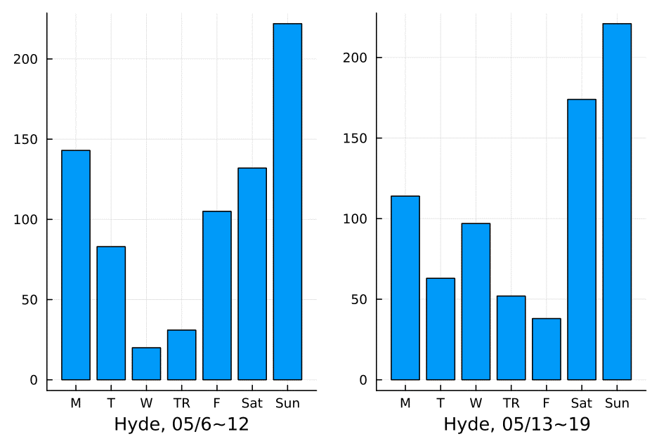

**Figure12: The effect of Rain and National Holidays**

In figure12, we can see the date is set on 05/06 ~ 05/12 and 05/13 ~ 05/19 (2019). 05/06 (Mon) is a national holiday in UK. Also, there are heavy rainfall during 2019/05/08 ~ 09. We can see the national holiday having drastic on usage in CBD, causing a giant difference between the two Mondays, 05/06 and 05/13. However Hyde Park was not that severely affected. From the figure we can also see less bike usage on 2019/05/08 ~ 09, regardless the location. Comparing to the result in Figure11, it is safe to say that precipitation affects bike users in CBD more than low temperature. But is this phenomenon universal across London? Or is this a business district thing? We may need to look for other proofs.

****

## 3 Predictive Modeling

We have chosen three stops to perform the prediction, which are Storey's Gate (N.o. 762), Abingdon Green (N.o. 583) and Abbey Orchard Street (N.o. 108). The three stops form a triangle with no other stops near them. This triangle is located near the iconic Big Ben and Westminster Abbey. However, we would first build the model and apply it on the first dataset as a test run.

**Figure13: Locations of the stops chosen**

### 3.1 The test run

In the test run, there wasn't a lot of alterations done on the first dataset. We added three more features, which are month, day and hour. Also, features "season" and "weather_code" are categorical data and need to be handled by **one-hot encoding**. Lastly, numerical data such as temperature, humidity and wind speed were normalized.

#### 3.1.1 Splitting the data

This is a typical supervised learning. To train the model, we split the data set into two subsets; the first subset is used to train the model, and the second(and smaller) one is used to validate the model by comparing the predicted labels to the known labels. The data is randomly split up to about 8:2. This is done by the `train_test_split` function in the 'scikitlearn' library in python. And as the result we get four data sets:

- **X_train**: The feature values we'll use to train the model
- **y_train**: The corresponding labels we'll use to train the model
- **X_test**: The feature values we'll use to validate the model
- **y_test**: The corresponding labels we'll use to validate the model

We tried training a model by fitting a suitable regression algorithm to the training data. We'll use a linear regression algorithm, a common starting point for regression that works by trying to find a linear relationship between the X values and the y label. The resulting model is a function that conceptually defines a line where every possible X and y value combination intersect. The result is as follows:

#### 3.1.2 Results

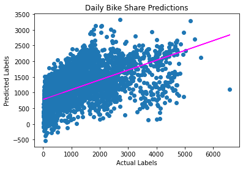

**Figure14: Predicted and Actual Bike Sharing Number of Linear Regression**

The figure shown a generally diagonal trend with several deviation values. One way to identify the model's error level is by mean square error, and the result is 814512. 

We then try an ensemble algorithm, the Random Forest algorithm, which typically would give a better result than the linear regression algorithm. Applying the Random Forest resuls in a huge decrease in MSE, which is now 55439.

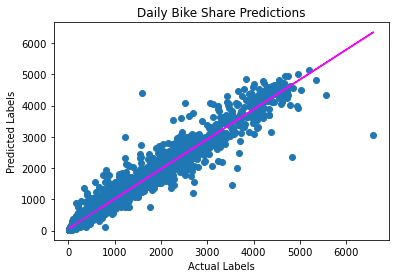

**Figure15: Predicted and Actual Bike Sharing Number of Decision Tree**

A more intuitive way to compare the improvement of the model is using the coefficient of determination(R-squared). As the R^2 score went up from 0.31 to 0.95, the assumption that the Random Forest is more powerful is confirmed. However, this could raise a concern of overfitting. The results above were all evaluations on the testing data. To see if there is overfitting or underfitting, it is ideal to also perform the prediction on the training data, and the results are shown in the table below:

**Table 4: Prediction results**

| Evaluation Metrics | Linear Regression | Random Forest  |
| --- | --- | --- |
| R^2 (Predicting training data) | 0.32 | 0.99 |
| R^2 (Predicting testing data) | 0.31 | 0.95 |

From the result of predicting the training data, there could be a possibility of overfitting when using the Random Forest algorithm. 

For predicting the single-stop usage we would only use the linear regression algorithm. The result we gained from the linear regression algorithm is not ideal in the test run, hence in the next section, we would try different method to improve it.

### 3.2 Predicting single-stop usage

We would now apply the algorithm to predict the usage of the three stops, base on the features shown in the table below. The features are slightly different from the previous section, due to the different information contained in the original datasets.

**Table 5: Features used in predicting usage of the three stops**

| Features | Description |
| --- | --- |
| yr  | 2017,18 or 19|
| mnth | What month of the year |
| weekday | What day of the week |
| hr | What time of the day |
| holiday | Is the day a holiday or not |
| workingday | Is the day a working day or not |
| temp | Temperature in Celsius |
| precipitation | The amount of precipitation  |

Similarly, numerical data such as temperature and precipitation are normalized. 

#### 3.2.1 Preliminary results

**Table 6: Prediction results of the three stops**

| Stop | #762 | #583 | #108  |
| --- | --- | --- | --- |
| R^2 | 0.53 | 0.45 | 0.54 |

As expected, without any manipulations or additional features added to the training data, the result would not be satisfactory. But there could still be useful information we could take advantage of from the dataset. 

#### 3.2.2 Creating linearity

Having features that linearly predict the outcome is ideal as it reduces the need for complex non-linear ML algorithms. From our observations in the exploratory analysis, we can see that bike share usage are greatly affected by different hours in a day and also different months. Unfortunately, when we look at the usage in stop #762 plotted along with hours and months, the plot is far from linear:

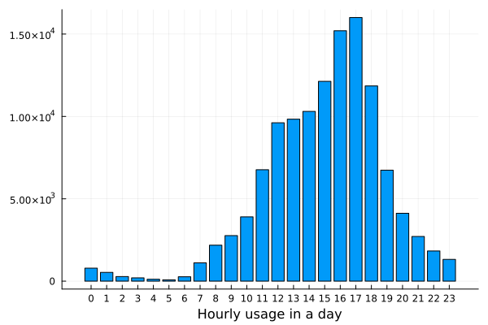 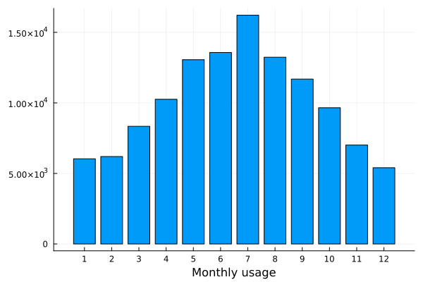

**Figure16: Hourly and monthly #762 Usage**

However, with a little manipulation we could generate a linear fit. We found that the hourly usage are lowest at 5AM, and for different hours in each day, the farther it gets from 5AM, the higher the usage. Therefore, we create a new feature "til5am" base on how far this particular time is from 5AM (For 4AM and 6AM, "til5am" is 1. For 5PM, "til5am" would be 12, which is the largest possible number.) In this case,  we have succesfully generate a feature which is somewhat linear to the usage. 

We could also carry out this process when we look at the "month" feature. We found out that in November and December, the usages are the lowest. And the usage of a month increases as its distance from 11/30, which is the midpoint of these two months, grows larger. Therefore, we create a new feature "tilnovdec" base on how far the month is from November or December (For January and October, "tilnovdec" is 1. For May and June , "tilnovdec" would be 5, which is the largest possible number.) Now we have two features that better describes the usage in different times. These behaviors can also be observed in stop #583 and #108, so we also apply them to the datasets of these two stops.  

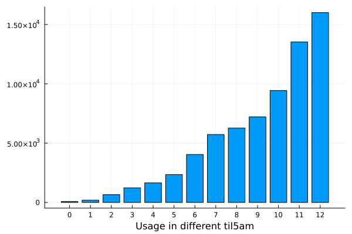 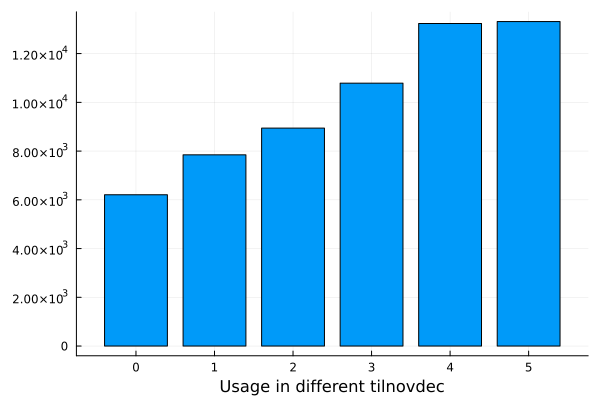

**Figure17: #762 Usage with new features**

#### 3.2.3 Creating lag values

We believe that the usage in the previous hour(s) in the same stop and the neighboring stops would also help predicting the usage in the next hour. Therefore, we calculated the correlations between the usage in this hour and the usage from an hour ago in stop #762. Our assumptions have been confirmed since the correlation coefficient turns out to be 0.72. Usage in two hours and three hours ago have also shown moderate relationship with the usage in this hour. Also, usage from the neighboring stops an hour ago also shown moderate relationship with the usage in this hour in stop #762.

**Table 7: Correlation coefficients between features and #762 usage**

| #762 Usage, lagged 1 hour | 2 hour | 3 hour  | #583 Usage, lagged 1 hour | #108 Usage, lagged 1 hour  |
| --- | --- | --- | --- | --- |
| 0.72 | 0.59 | 0.45 | 0.51 | 0.39 |

Same characteristics can be found in stop #583 and stop #108. Therefore, we added the usage 1, 2 and 3 hour(s) ago from the own stop and the usage from neighboring stops 1 hour ago as new features.

Before we train the model again, we believe that even though features such as year, month, weekday and hour do not show linearity, they could still offer hidden information. Hence, we shall treat them as categorical data and one-hot encode them.

### 3.3 New results

**Table 8: Prediction results of the three stops(R^2)**

| Stop | #762 | #583 | #108  |
| --- | --- | --- | --- |
| Original | 0.53 | 0.45 | 0.54 |
| Improved | 0.64 | 0.54 | 0.59 |

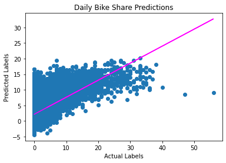 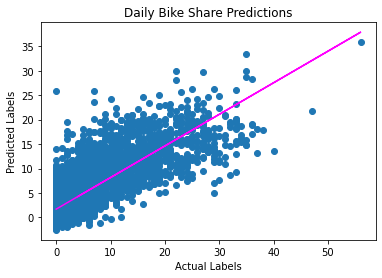

**Figure18: #762 Prediction results( Original | Improved )**

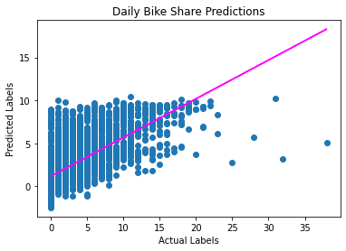 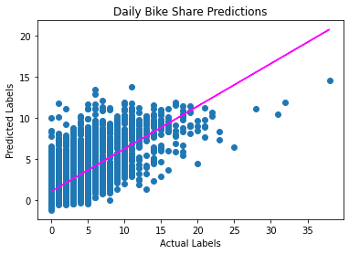

**Figure19: #583 Prediction results( Original | Improved )**

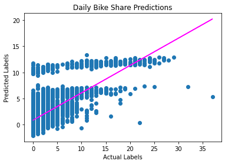 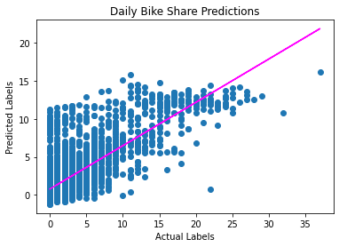

**Figure20: #108 Prediction results( Original | Improved )**

Results in all three stops have shown improvement. The R^2 scores imdicate that these models are now very close to being reliable. Lastly, we check for the instance of over/underfitting.

**Table 9: Results comparison between training/testing data(Improved model, R^2)**

| Stop | #762 | #583 | #108  |
| --- | --- | --- | --- |
| Training | 0.66 | 0.54 | 0.58 |
| Testing | 0.64 | 0.54 | 0.59 |

As the results suggested, there is no clear sign of overfitting or underfitting.

### 3.4 Model Discussion and Conclusion

In this section we would discuss what we have learned after building the model.

1. Size does matter: We have a more accurate result when predicting the usage in a single stop than predicting the usage of the whole city. We found this reasonable because we provided 3 years of data from a single stop to be trained, while the data of the whole city were only two years long. Also, stop #762 has the highest total usage in the three stops, and this could be the reason why it gave the highest performance when predicting.

2. We believe when we train the model with data from a certain stop, it would learn its characteristic, whether it is in a school area, business area, tourist attraction area and others, therefore the predicting result is better comparing to the prediction of the whole city, since all the uniqueness of each stop has been mixed up.

3. Lagged versions of the usage did help predicting the future. We assume this would allow varying amounts of recent history to be brought into the forecast, and it did. Adding the lagged usage resulted in a major part of the improvement, in terms of the increase of R^2 score.

4. Manipulating features to give a more linear fit also helped improve the result a bit, but it wasn't as significant as adding the lagged data. We think the problem comes from giving the same feature value to different points in time. For example, October and January has the same value of "tilnovdec", but October had higher usage than January. By doing this, the prediction of October usage could be smaller, and the prediction of January usage could be larger, which canceled out the positive influence given by the generating of a close-to-linear feature, that is "tilnovdec" or "til5am"

5. For 2017 to 2019 we could only find daily weather information. Obviously, assuming the same weather condition to last for the entire day is questionable, but that is the best we could do for the time being. We believe if we used hourly weather the accuracy would go up even more.

 
## 4 Discussion

Based on what was done in previous sections, we have completed a preliminary forecast for the number of shared bikes that will be used in any given 1 hour time period in a single bike share stop with reasonable accuracy, which basically achieved our objective.

However, there are still much progress to make in a future study to make the model more accurate, have more constructive opinions, and possess more guidance value.

First of all, this model is just a preliminary analysis or a starting point. For future study, we could try to:

1. Find bike share stops with similar traits and group them(using k-means or other methods). Actually, doing predictions on a single stop may result in a sample size that is too small. If we gather bike share stops with similar traits and generate a larger sample size, we could improve the performance further more. However, including too much stops in a group may also cancel out the uniqueness of each group. Therefore, there must be a trade-off and we need to find the optimal.

2. The second dataset also contains the count of users returning their bike at a certain stop. After a similar process, we could also build a model predict the count of returns in the future. With these predictions, combining the real-time available bike amounts and the number of the full capacity at a certain stop, we could build an application warning the service provider whether a bike stop would run out of bikes in the following hours. Users could also monitor the renting situations at their desired stops, and the application could help them make better travel decisions.  

3. Give different weights to different features. Our model has combined all of the features together with the same weight, which is not very accurate when it comes to determining the main influential factor when arranging shared bikes. Further work on finding out how each factor influences the outcome should be done to make the model more accurate.

4. Give insight to whether a new bike stop should be implemented or a existing bike stop should be discard. The model is made to aid the service providers with dispatching bikes efficiently and for travelers to better plan their trips. However, these predictions could also tell us that whether the demand in a certain region is always larger than the supply of bikes. In this case, a new bike stop can be considered to be built in said area. Of course the situation can be entirely opposite where we find a bike stop is never really used and close to being deserted. 

## References {.page_break_before}

<!-- Explicitly insert bibliography here -->

[1] AndersOhrn (2020) Bike-share usage in London and Taipei Network, Kaggle. Available at: https://www.kaggle.com/datasets/ajohrn/bikeshare-usage-in-london-and-taipei-network (Accessed: October 24, 2022). 

[2] Mavrodiev, H. (2019) London Bike Sharing Dataset, Kaggle. Available at: https://www.kaggle.com/datasets/hmavrodiev/london-bike-sharing-dataset/discussion?resource=download (Accessed: October 24, 2022). 

[3] N, N. (2021) Predicting bike-share users with machine learning, Medium. Towards Data Science. Available at: https://towardsdatascience.com/predicting-no-of-bike-share-users-machine-learning-data-visualization-project-using-r-71bc1b9a7495 (Accessed: November 23, 2022). 
