---
title: Bike-Share Usage in London Network Analysis
keywords:
- markdown
- publishing
- manubot
lang: en-US
date-meta: '2022-12-01'
author-meta:
- Mulin Wan
- Jingwen Yao
- Yunze Guo
- Bo-Yang Wang
header-includes: |-
  <!--
  Manubot generated metadata rendered from header-includes-template.html.
  Suggest improvements at https://github.com/manubot/manubot/blob/main/manubot/process/header-includes-template.html
  -->
  <meta name="dc.format" content="text/html" />
  <meta name="dc.title" content="Bike-Share Usage in London Network Analysis" />
  <meta name="citation_title" content="Bike-Share Usage in London Network Analysis" />
  <meta property="og:title" content="Bike-Share Usage in London Network Analysis" />
  <meta property="twitter:title" content="Bike-Share Usage in London Network Analysis" />
  <meta name="dc.date" content="2022-12-01" />
  <meta name="citation_publication_date" content="2022-12-01" />
  <meta name="dc.language" content="en-US" />
  <meta name="citation_language" content="en-US" />
  <meta name="dc.relation.ispartof" content="Manubot" />
  <meta name="dc.publisher" content="Manubot" />
  <meta name="citation_journal_title" content="Manubot" />
  <meta name="citation_technical_report_institution" content="Manubot" />
  <meta name="citation_author" content="Mulin Wan" />
  <meta name="citation_author_institution" content="CEE, University of Illinois Urbana-Champaign" />
  <meta name="citation_author" content="Jingwen Yao" />
  <meta name="citation_author_institution" content="CEE, University of Illinois Urbana-Champaign" />
  <meta name="twitter:creator" content="@Yaojune" />
  <meta name="citation_author" content="Yunze Guo" />
  <meta name="citation_author_institution" content="CEE, University of Illinois Urbana-Champaign" />
  <meta name="citation_author" content="Bo-Yang Wang" />
  <meta name="citation_author_institution" content="CEE, University of Illinois Urbana-Champaign" />
  <link rel="canonical" href="https://uiceds.github.io/cee-492-term-project-fall-2022-jiaotonguniv/" />
  <meta property="og:url" content="https://uiceds.github.io/cee-492-term-project-fall-2022-jiaotonguniv/" />
  <meta property="twitter:url" content="https://uiceds.github.io/cee-492-term-project-fall-2022-jiaotonguniv/" />
  <meta name="citation_fulltext_html_url" content="https://uiceds.github.io/cee-492-term-project-fall-2022-jiaotonguniv/" />
  <meta name="citation_pdf_url" content="https://uiceds.github.io/cee-492-term-project-fall-2022-jiaotonguniv/manuscript.pdf" />
  <link rel="alternate" type="application/pdf" href="https://uiceds.github.io/cee-492-term-project-fall-2022-jiaotonguniv/manuscript.pdf" />
  <link rel="alternate" type="text/html" href="https://uiceds.github.io/cee-492-term-project-fall-2022-jiaotonguniv/v/ec479aee3a94307ac38e12505e721eda72ba723d/" />
  <meta name="manubot_html_url_versioned" content="https://uiceds.github.io/cee-492-term-project-fall-2022-jiaotonguniv/v/ec479aee3a94307ac38e12505e721eda72ba723d/" />
  <meta name="manubot_pdf_url_versioned" content="https://uiceds.github.io/cee-492-term-project-fall-2022-jiaotonguniv/v/ec479aee3a94307ac38e12505e721eda72ba723d/manuscript.pdf" />
  <meta property="og:type" content="article" />
  <meta property="twitter:card" content="summary_large_image" />
  <link rel="icon" type="image/png" sizes="192x192" href="https://manubot.org/favicon-192x192.png" />
  <link rel="mask-icon" href="https://manubot.org/safari-pinned-tab.svg" color="#ad1457" />
  <meta name="theme-color" content="#ad1457" />
  <!-- end Manubot generated metadata -->
bibliography:
- content/manual-references.json
manubot-output-bibliography: output/references.json
manubot-output-citekeys: output/citations.tsv
manubot-requests-cache-path: ci/cache/requests-cache
manubot-clear-requests-cache: false
...


<small><em>
This manuscript
([permalink](https://uiceds.github.io/cee-492-term-project-fall-2022-jiaotonguniv/v/ec479aee3a94307ac38e12505e721eda72ba723d/))
was automatically generated
from [uiceds/cee-492-term-project-fall-2022-jiaotonguniv@ec479ae](https://github.com/uiceds/cee-492-term-project-fall-2022-jiaotonguniv/tree/ec479aee3a94307ac38e12505e721eda72ba723d)
on December 1, 2022.
</em></small>

## Authors


+ **Mulin Wan**<br>
    · {.inline_icon}
    [mulin-wan](https://github.com/mulin-wan)<br>
  <small>
     CEE, University of Illinois Urbana-Champaign
  </small>

+ **Jingwen Yao**<br>
    · {.inline_icon}
    [jingwenyaooo](https://github.com/jingwenyaooo)
    · {.inline_icon}
    [Yaojune](https://twitter.com/Yaojune)<br>
  <small>
     CEE, University of Illinois Urbana-Champaign
  </small>

+ **Yunze Guo**<br>
    · {.inline_icon}
    [cyfcx2](https://github.com/cyfcx2)<br>
  <small>
     CEE, University of Illinois Urbana-Champaign
  </small>

+ **Bo-Yang Wang**<br>
    · {.inline_icon}
    [byw-5](https://github.com/byw-5)<br>
  <small>
     CEE, University of Illinois Urbana-Champaign
  </small>


# Abstract

## 1 Introduction

### Description

### 1.1 Data set:

In this project, our goal is to understand how various conditions affect the usage of public bicycle sharing system. We picked London area as the observing site. The main data came from two data sets on Kaggle, titled "London and Taipei Bike-Share Data" and "London bike sharing data set." 

#### 1.1.1 London and Taipei Bike-Share Data

This data set contains every single bike rental transaction in a total of 802 bike-sharing stops in the London area from 2017 until the Covid outbreak. Each transaction provides the following information:

Table 1: Description of London.csv

| Object | Description |
| --- | --- |
| rental_id | id of people who rent the bike |
| duration | duration of rental |
| bike_id  | id of bike |
| end_rental_date_time | date and time of end rental |
| end_station_id | id of end station |
| end_station_name | name of end station |
| start_rental_date_time | date and time of start rental |
| start_station_id | id of end station |
| start_station_name | name of start station |
| start_rental_date_time | date and time of start rental |

#### 1.1.2 London bike sharing data set

This data set shows how many bike-sharing transactions took place in each hour in 2015 to 2016. Comparing to the first data set, this one is more compact since it does not contain individual information. However, it helped providing information on weather conditions. Although the time span doesn't overlap with the first data set, it encourages us to find time span matching weather data to help with further analysis.


Table 2: Description of London_merged.csv

| Object | Description |
| --- | --- |
| timestamp  | timestamp field for grouping the data |
| cnt | the count of a bike sharing |
| t1 | real temperature in Celsius |
| t2 | apparent temperature in Celsius |
| hum | humidity in percentage |
| windspeed | wind speed in km/h |
| isholiday | boolean field - 1 holiday / 0 non holiday - refers to bank holidays |
| isweekend | boolean field - 1 if the day is weekend / 0 if a working day |
| season | category (0-spring; 1-summer; 2-autumn; 3-winter) |
| weathercode | different weather condition|

Table 3: Description of weathercode

| weathercode | Description |
| --- | --- |
| 1 | clear; mostly clear but have some values with haze/fog|
| 2 | scattered clouds / few clouds|
| 3 | broken clouds|
| 4 | clear; cloudy|
| 7 | clear; light rain shower / rain / light rain|
| 10 | clear; rain with thunderstorm|
| 26 | snowfall|
| 90 | freezing fog |

In addition to season and isweekend, from the timestamp feature we can extract many separate time features - day of the week (as one scaled column or as seven columns of ismonday, istuesday etc.), month number, day of the month, week number, hour, minute. In combination with external data, we could add is_light for after dawn times and is_schoolholiday to match London school holiday times.

#### 1.1.3 Link of dataset:

[London and Taipei bike sharing](https://www.kaggle.com/datasets/ajohrn/bikeshare-usage-in-london-and-taipei-network)

[London bike sharing](https://www.kaggle.com/datasets/hmavrodiev/london-bike-sharing-dataset/discussion?resource=download)

### 1.2 Proposal

Recently, bike-sharing in big cities has become an important part of residents' daily life, and its role in urban transportation system has never been more significant. Around the world, there are more than 500 bike-sharing schemes. By making bicycles available for short-distance excursions in metropolitan areas, such systems often attempt to minimize traffic, noise, and air pollution. They do this by encouraging people to use them instead of motorized vehicles. The number of users on any given day can vary greatly for such systems. Looking at the spatiotemporal bike-sharing data in London, we could explore patterns, describe variations, or model the data in many different ways. From the two data sets, we may have a chance to take a peek at the residents' bike-renting behavior through many angles.

Previous work has shown that weather is a key driver for variation in usage. <sup>[1]</sup><sup>[2]</sup><sup>[3]</sup> Aside from weather, We believe there are a lot more important factors such as peak/off-peak hours, weekday/weekend, bike-stop location etc. By utilizing these data sets, we hope to find as many correlations between the users behavior and various factors. 

We assume that the outcomes and models from the prediction and modeling analyses utilizing data collected before Coronavirus pandemic are still valid now.

We plan to start by looking at the trends. How does weather or other factors affect the London area overall? Although the answer could be found in both data sets, the structure of the second data set(see 1.1.2 London_merged.csv) would make the job easier if we were only looking at big trends. Then we would look at the microscopic data provided by the first data set(1.1.1 London.csv), and hope it would support our claims.

Lastly, after each correlation is explored, we will try to formulate a Machine Learning model that would help us predict the hourly bike-sharing usage in the stops. Our objective is to apply and optimize Machine Learning models that accurately forecast the number of ride-sharing bikes that will be used in any given 1 hour time-period and help users manage their travel time, as well as for service providers to better dispatch bikes to maintain service quality, using the information that is currently available (such as weather, season, etc.) about that time/day.

## 2 Exploratory Data Analysis

In this section, we look at different factors affecting the usage of the bike sharing system in London. Each factors that we are interested is plotted along with the average usage per hour. Then we look for micro trends in specific bike-stop that contradicts with the big trends we found.

### 2.1 Data Wrangling

#### 2.1.1 Data cleaning process

Both of the csv files need to be restructured in some ways before the analyzing process. For instance, the exact time is stored as strings: 

"2015/1/4  12:00:00 AM"

Information such as date and time could be extracted from within. The somehow trickier part is the day-of-the-week. We add a certain number to the date and take the remainder after divided by 7 to get the day-of-the-week.

### 2.2 Analysis and Visualization

#### 2.2.1 Large trends

In this section, we hope to find out how different factors affect the average usage per hour in 2015-2016. 


****


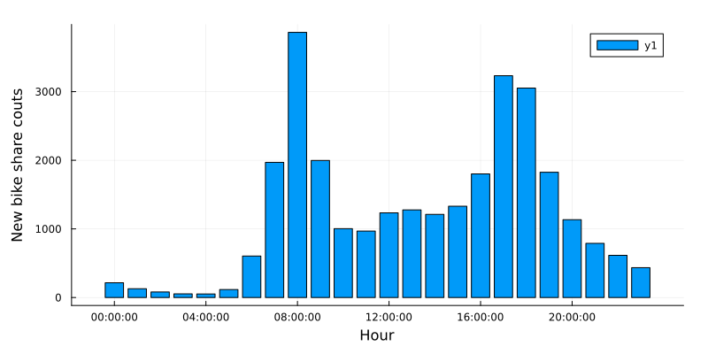

**Figure1: Hourly average usage on weekdays**

Figure1 shows how average bike-sharing usage distribute in different hours in a weekday. In the image, one could easily spot a double-peaked distribution. This comes with no surprise - the rush hour in weekdays generates a lot of commuting demands, and apparently people turn to bike-sharing in these hours. On average, over three thousand people rented a bike at 08:30 everyday, the busiest time in terms of bike-sharing usage.


****


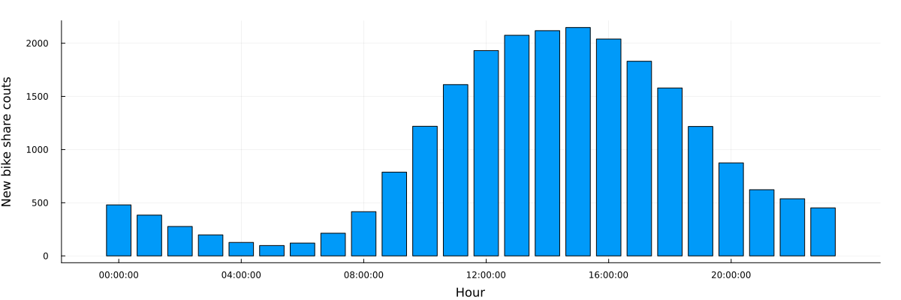

**Figure2: Hourly average usage on weekends**

Figure2 shows how the new bike share demand distribute in different hours in weekends. Base on the image, we can speculate that Londoners are most active between 11:00 and 19:00 on weekends. 


****


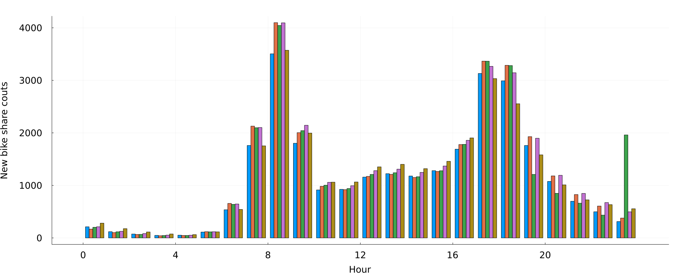

**Figure3: Hourly average usage between different weekdays**

Figure3 generally agrees with Figure1. During rush hours, bike-sharing usage climates. There are not many conclusions to make according to this figure, except that usage characteristics are mostly the same during Tuesday to Thursday. Consider a two-working-day span that lies in Tuesday to Thursday, with nearly identical weather conditions, we could speculate that these two days would have similar bike-sharing usage. Mondays and Fridays on the other hand, are seen to have slight difference to their weekday counterparts. 


****


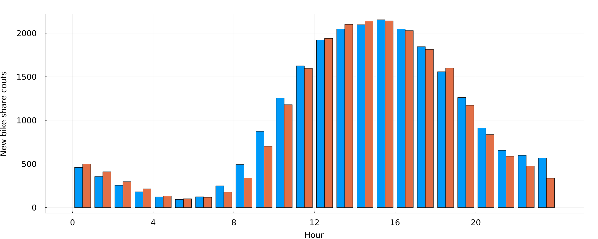

**Figure4: Hourly average usage between different days in the weekend**

Figure4 shows that the overall difference of new bike share between the two days of the weekend is not big except one logical difference: since Monday is a working day, Sunday's usage at night can be seen to be smaller than Saturday.


****


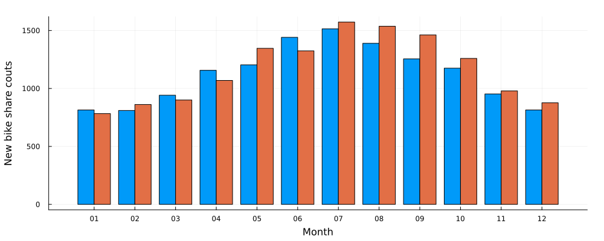

**Figure5: Average usage/hour between different months**

In figure 5, the hourly trend is still similar to that in figure1. Meaning in a given day regardless of the month, rush hour still generates the most bike-share usage. However, large differences between months could be spotted, especially between the April to October period and the November to March period. We can easily come to a conclusion that users are less willing to ride a bike in the cold.


****


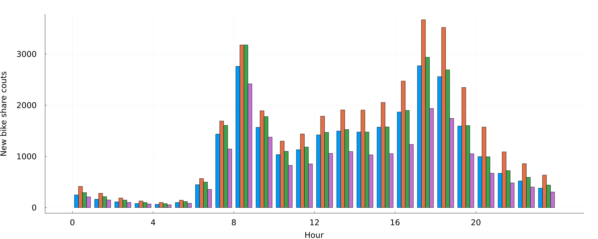

**Figure6: Hourly average usage between seasons**


**Figure7: Average usage/hour between seasons**

According to figure6 and figure7, it can be seen that the demand for new bike share in London is relatively higher in summer and autumn overall, especially in summer. Winter is undoubtedly the lowest, but in this image it can be seen that the demand for new bike share is lower in spring than in autumn. We can speculate that people are more willing to rent a bike in the season of relatively higher temperature, and the weather in autumn is more suitable for bike share than spring in the London area. 


****

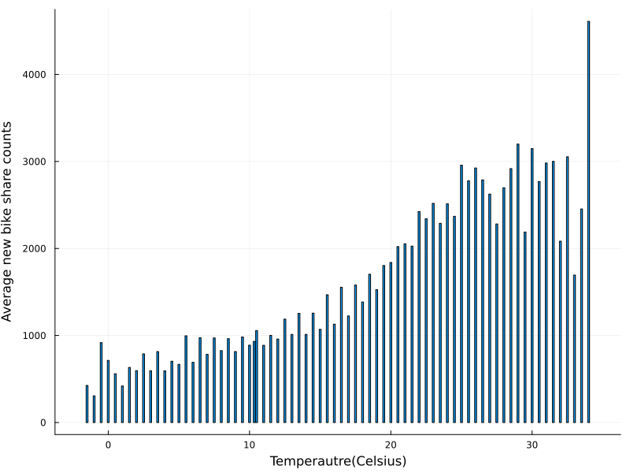


**Figure8: Average usage/hour in different temperatures**

In figure8, temperatures over 34 degree Celsius are all recorded as 34. If we neglect the last bar, we can see that bike-sharing usage gradually increases until the temperature reaches 30, and then went downwards. 


****


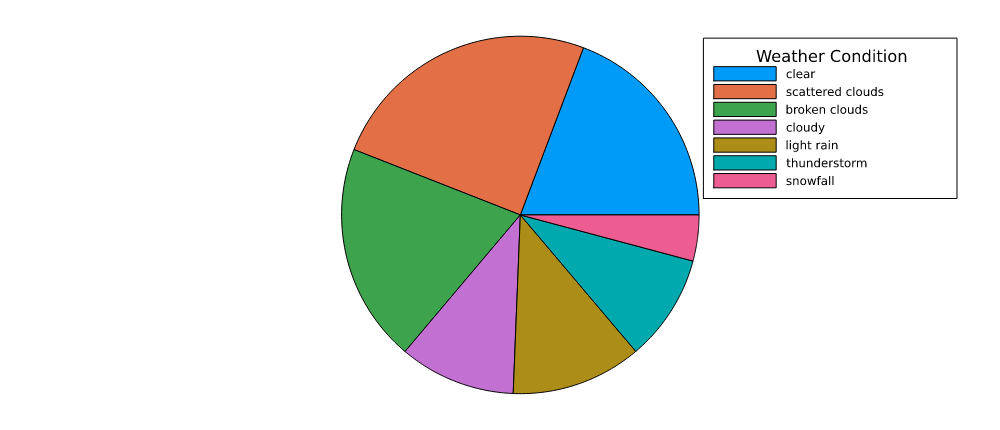

**Figure9: Bike-share usage under 7 weather conditions**

This pie chart shows the how users utilize the bike sharing system in different weather conditions. Basically, when the weather is good, people tend to utilize the bike sharing system more often, which is easy to understand. In London, raining doesn't bother this city that much since Londoners have developed a certain life style or fashion to accommodate their unique weather condition. This phenomenon can also be spotted right here,since there is not a huge difference in usage between "cloudy", "light rain" and "thunderstorm". 


****


## 3 Predictive Modeling

### 3.1 Spotting micro trends (Individual behaviors varying with bike stop locations)

In the previous section, we have come up with some speculations, such as:

  During weekdays, usage during rush hours are often higher than non-peak hours.
  Usage in weekdays are often higher than weekends.
  Usage in warmer days are often higher than colder days.

But as we move closer the the actual stop-by-stop prediction, we need to understand how the location and the characteristc of each stop changes how the large trends' impact on those stops. The main data set (1.1.1 London.csv) provides a chance to look extremely closely to certain stops in certain time spans, for us to verify out speculations, or to discover new revelation.


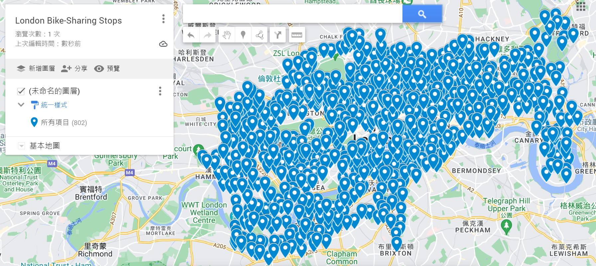


**Figure10: Bike-share stops in London area**

In the data set there are 802 stops, as shown in the figure above. We will be looking at two stops:

  Triangle Car Park, Hyde Park : Located right in the middle of the famous tourist attraction Hyde Park. (Will be later denoted as Hyde)
  Queen Street 1, Bank : Located in the central of business districts . (Will be later denoted as CBD)
  
And we will see how different conditions affect them respectively.

****


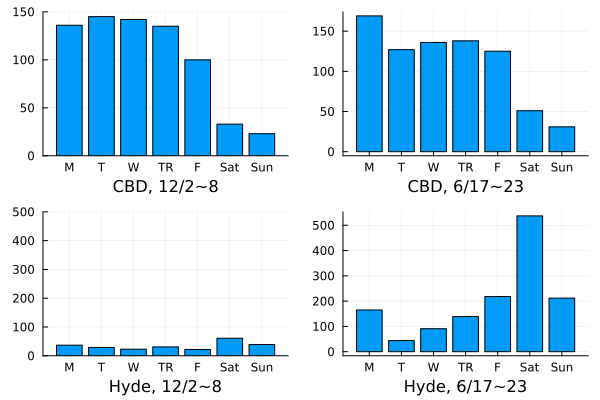

**Figure11: CBD and Hyde Park Comparison, Winter versus Summer**

In figure11, we can see the date is set on 12/02 ~ 12/08 and 06/17 ~ 06/23 (2019). They are both regular non-holiday weeks with little to none precipitation. Although we almost came a conclusion that usage in winter is almost always lower than that of summer, in the busy business district, we can hardly tell the impact from weather.On the other hand, bike-share usage took a great hit from summer to winter in Hyde Park. Meaning tourist activities are significantly lower in cold times. 

Bike stops near tourist attractions can have another trait different than the speculations we made from observing large trends. We can see in June, Hyde Park attracts large amount of bike usage in weekends. This serves as a reminder that weekdays do not always have larger usage than weekends when predicting.

****


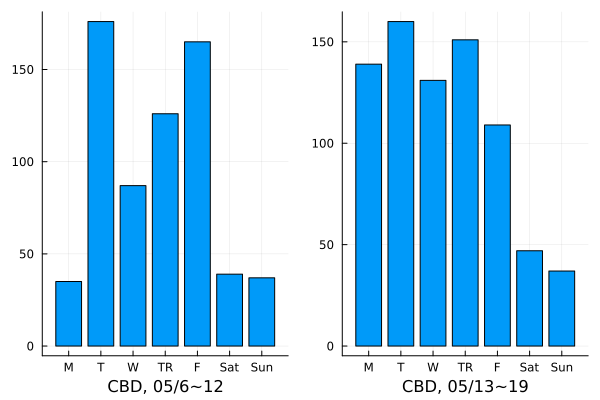

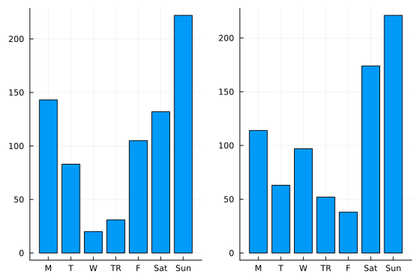

**Figure12: The effect of Rain and National Holidays**

In figure12, we can see the date is set on 05/06 ~ 05/12 and 05/13 ~ 05/19 (2019). 05/06 (Mon) is a national holiday in UK. Also, there are heavy rainfall during 2019/05/08 ~ 09. We can see the national holiday having drastic on usage in CBD, causing a giant difference between the two Mondays, 05/06 and 05/13. However Hyde Park was not that severely affected. From the figure we can also see less bike usage on 2019/05/08 ~ 09, regardless the location. Comparing to the result in Figure11, it is safe to say that precipitation affects bike users in CBD more than low temperature. But is this phenomenon universal across London? Or is this a business district thing? We may need to look for other proofs.


### 3.2 Variables for predicting

The main data set (1.1.1 London.csv) although contains rich content, is too time-consuming to perform a thorough exploratory data analysis right now. But until the next step, it would be neccesary to look for deeper connections between the dots. For now, combining large trends and micro trends, we have thought of the following variables for predicting bike-share usage:

| Variables | Description |
| --- | --- |
| Time  | What time of the day |
| Day | What day of the week |
| Holiday | Is it a holiday or not |
| Temp | Temperature in Celsius |
| Light | Whether there is still daylight |
| Location | Characteristics of the bike stop location |
| Surrounding | Renting availability in nearby stops |
| Transport | Other means of transportation available |
| Crime | Level of safety in the neighborhood  |

Due to the complexity of the problem, we would then narrow the observing area from London entirely to a certain area, hopefully containing schools, tourist attractions, business areas and residential area in order to give diversity to the problem.


### 3.3 Train a Regression Model

#### 3.3.1 Splitting the data

As the data has been explored, the next step is to train a regression model and predict the bike sharing number(cnt):

```python
X = df.drop("cnt", axis=1)
y = df["cnt"]
print('Parameters:',X[:10])
```

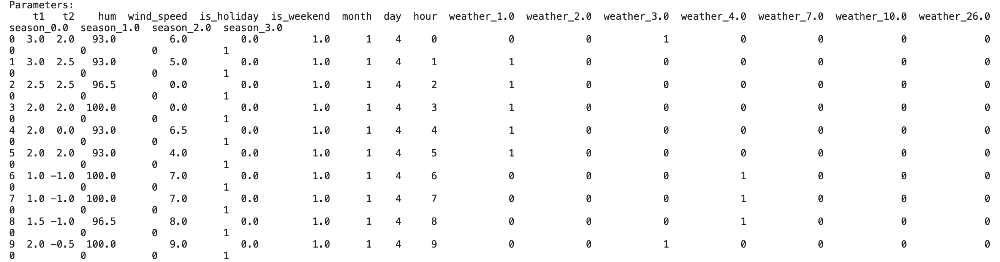

**Figure13: Splitting The Bike Sharing Number From Other Parameters**

To validate the training model, we split the data set into two subsets; the first subset is used to train the model, and the second(and smaller) one is used to validate the model by comparing the predicted labels to the known labels. The data is randomly split to about 7:3. We realize it by the `train_test_split` function in the 'scikitlearn' library in python. And the result is four data sets:

- **X_train**: The feature values we'll use to train the model
- **y_train**: The corresponding labels we'll use to train the model
- **X_test**: The feature values we'll use to validate the model
- **y_test**: The corresponding labels we'll use to validate the model

The next step is to train the model with a proper regression method. The group used  a linear regression algorithm, which is basic and commonly used, to find a linear relationship between X and y. 

#### 3.3.2 Scaling & Training

Scaling is also a preparation step for machine learning. By scaling the numeric columns in the data set to a common scale with the standardization method, the distribution could have a unit standard deviation. 'sklearn.preprocessing' and 'sklearn.linear_model' package provide a convenient algorithm to realize the model:

```python
# Fit a linear regression model on the training set
model = LinearRegression().fit(X_train, y_train)
```

### 3.4 Evaluate Trained Model


**Figure14: Predicted and Actual Bike Sharing Number of Linear Regression**

It is a generally diagonal trend with several deviation values. The group uses mean square error to identify our model's error level, and the result is 814512. One reasonable explanation is linear regression can only clearly show the data trend, but it cannot cover too much data in a data set. To improve the power of our model, the group also uses the decision tree method, and the result of MSE is 97082:


**Figure15: Predicted and Actual Bike Sharing Number of Decision Tree**

A more intuitive way to compare the improvement of the model is using the coefficient of determination(R-squared). 

| Evaluation Metrics | Linear Regression | Decision Tree |
| --- | --- | --- |
| MSE | 814512 | 97082 |
| R^2 | 0.31 | 0.91 |

As the R^2 is more than 90% now, the improvement of the model is obvious.

### 3.5 Model Discussion and Conclusion

In conclussion, the results of the model suggested that:

1. In Central Business Districts in London, seasonal and weather factors are less influential. According to our hypothesis, it is the population around the block and economic activity density that decide how many bikes are needed to fulfill the demands.

2. In tourist attraction areas, weather and temperature are considered as key factors. With lower temperatures and worse weather conditions, people are reluctant to use shared bikes.

3. Besides, in tourist attraction areas, there is usually a greater usage of shared bikes during the weekends, which gives us a hint that weekday usage is not always greater than that in the weekends. Under this consideration, service providers need to have at least two strategies to cope with the amount of bikes provided in each station.

4. Using time of day, day of the week, holiday, temperature, wide, location, surrounding rental availability, availability of other transportation, and nearby safety level are all influential factors for prediction. We choose to apply the decision tree to explore the effects of these influential factors on the number of shared bikes. In this way, we can improve the accuracy of the model, getting better results, and helping both the users and service providers. 

## 4 Discussion

Based on what was done in previous sections, we have completed a preliminary forecast for the number of shared bikes that will be used in any given 1 hour time period with reasonable accuracy. Regarding to helping the service provider, we have also given some ideas about bike distribution in each station, providing some help in maintaining service quality, which basically achieved our objective.

However, there are still much progress to make in a future study to make the model more accurate, have more constructive opinions, and possess more guidance value.

First of all, this model is just a preliminary analysis or a starting point. For future study, we could try to:

1. Improve our ML model.
Our model has combined all of the factors together with the same weight, which is not very accurate when it comes to determining the main influential factor when arranging shared bikes. Further work on finding out how each factor influences the outcome should be done to make the model more accurate.

2. Expand the scale.
In order to find out the patterns quicker, we chose to use a limited dataset, which is not comprehensive enough. In the future, we will expand the dataset to include more circumstances to optimize the model.

3. Generate more ideas.
The model is made to aid the service providers with arranging bikes efficiently and spending less time when selecting a new bike station. In the future, we will take more geographic information, political information, economical information and cultural information into consideration, making predictions about which place is eager to have a bike station and how many bikes should be provided at least.


## References {.page_break_before}

<!-- Explicitly insert bibliography here -->
<div id="refs"></div>


[1] AndersOhrn (2020) Bike-share usage in London and Taipei Network, Kaggle. Available at: https://www.kaggle.com/datasets/ajohrn/bikeshare-usage-in-london-and-taipei-network (Accessed: October 24, 2022). 

[2] Mavrodiev, H. (2019) London Bike Sharing Dataset, Kaggle. Available at: https://www.kaggle.com/datasets/hmavrodiev/london-bike-sharing-dataset/discussion?resource=download (Accessed: October 24, 2022). 

[3] N, N. (2021) Predicting bike-share users with machine learning, Medium. Towards Data Science. Available at: https://towardsdatascience.com/predicting-no-of-bike-share-users-machine-learning-data-visualization-project-using-r-71bc1b9a7495 (Accessed: November 23, 2022). 
