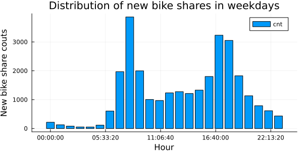
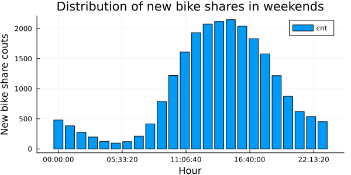
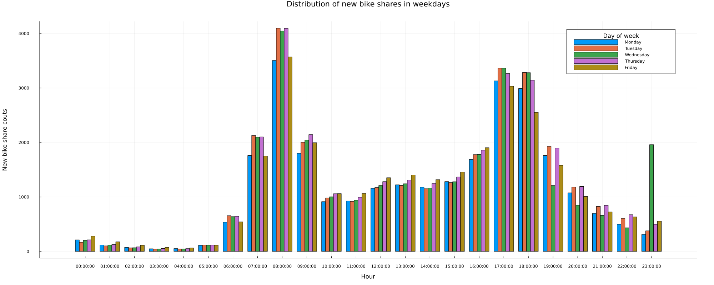
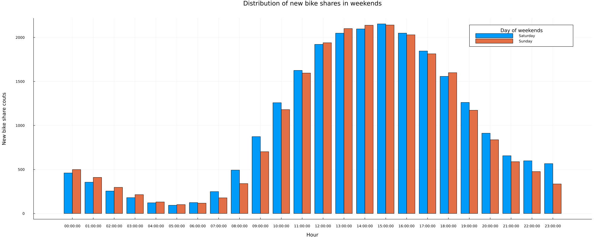
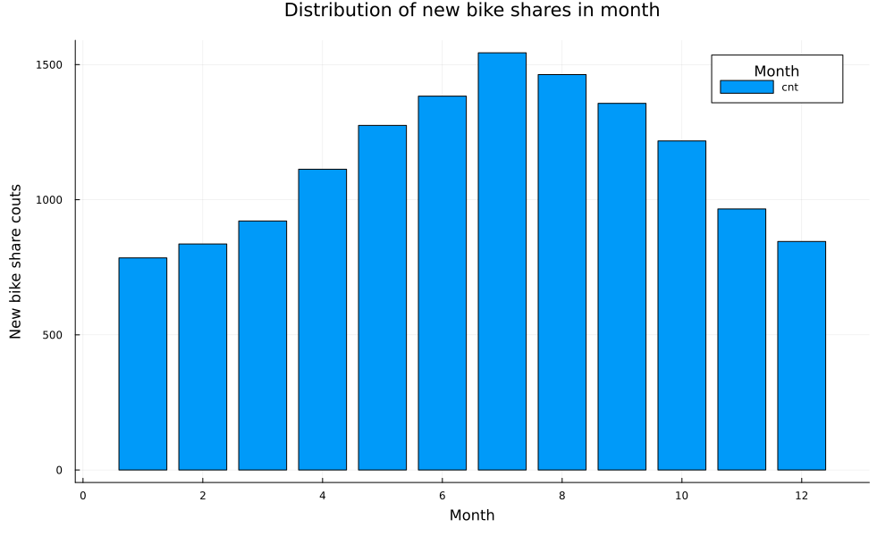
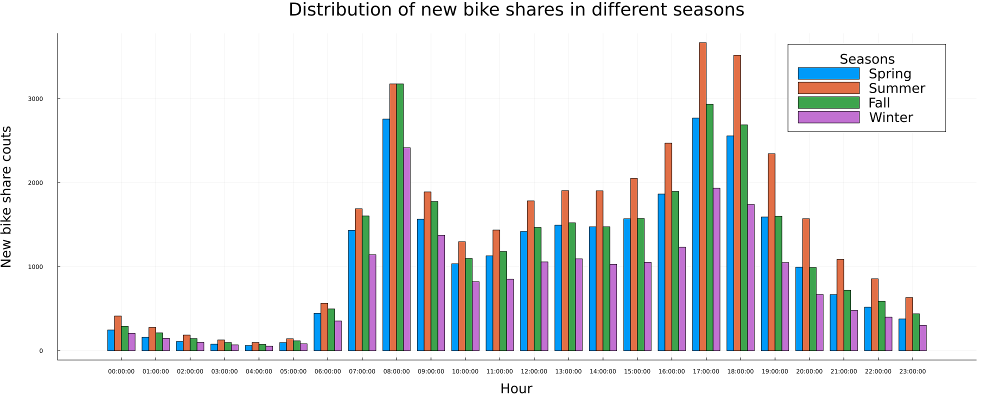
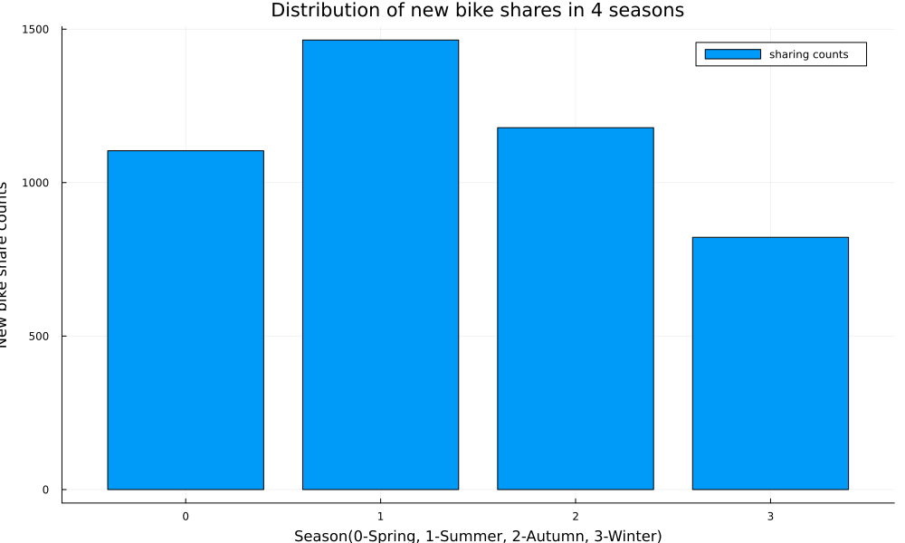
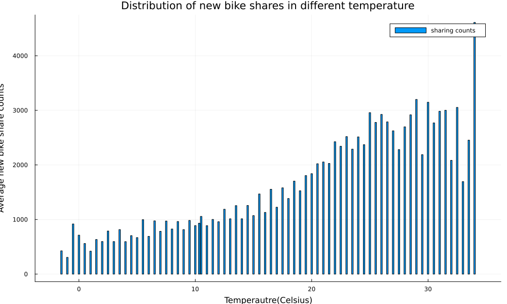

---
title: Bike-Share Usage in London Network Analysis
keywords:
- markdown
- publishing
- manubot
lang: en-US
date-meta: '2022-10-31'
author-meta:
- Mulin Wan
- Jingwen Yao
- Yunze Guo
- Bo-Yang Wang
header-includes: |-
  <!--
  Manubot generated metadata rendered from header-includes-template.html.
  Suggest improvements at https://github.com/manubot/manubot/blob/main/manubot/process/header-includes-template.html
  -->
  <meta name="dc.format" content="text/html" />
  <meta name="dc.title" content="Bike-Share Usage in London Network Analysis" />
  <meta name="citation_title" content="Bike-Share Usage in London Network Analysis" />
  <meta property="og:title" content="Bike-Share Usage in London Network Analysis" />
  <meta property="twitter:title" content="Bike-Share Usage in London Network Analysis" />
  <meta name="dc.date" content="2022-10-31" />
  <meta name="citation_publication_date" content="2022-10-31" />
  <meta name="dc.language" content="en-US" />
  <meta name="citation_language" content="en-US" />
  <meta name="dc.relation.ispartof" content="Manubot" />
  <meta name="dc.publisher" content="Manubot" />
  <meta name="citation_journal_title" content="Manubot" />
  <meta name="citation_technical_report_institution" content="Manubot" />
  <meta name="citation_author" content="Mulin Wan" />
  <meta name="citation_author_institution" content="CEE, University of Illinois Urbana-Champaign" />
  <meta name="citation_author" content="Jingwen Yao" />
  <meta name="citation_author_institution" content="CEE, University of Illinois Urbana-Champaign" />
  <meta name="twitter:creator" content="@Yaojune" />
  <meta name="citation_author" content="Yunze Guo" />
  <meta name="citation_author_institution" content="CEE, University of Illinois Urbana-Champaign" />
  <meta name="citation_author" content="Bo-Yang Wang" />
  <meta name="citation_author_institution" content="CEE, University of Illinois Urbana-Champaign" />
  <link rel="canonical" href="https://uiceds.github.io/cee-492-term-project-fall-2022-jiaotonguniv/" />
  <meta property="og:url" content="https://uiceds.github.io/cee-492-term-project-fall-2022-jiaotonguniv/" />
  <meta property="twitter:url" content="https://uiceds.github.io/cee-492-term-project-fall-2022-jiaotonguniv/" />
  <meta name="citation_fulltext_html_url" content="https://uiceds.github.io/cee-492-term-project-fall-2022-jiaotonguniv/" />
  <meta name="citation_pdf_url" content="https://uiceds.github.io/cee-492-term-project-fall-2022-jiaotonguniv/manuscript.pdf" />
  <link rel="alternate" type="application/pdf" href="https://uiceds.github.io/cee-492-term-project-fall-2022-jiaotonguniv/manuscript.pdf" />
  <link rel="alternate" type="text/html" href="https://uiceds.github.io/cee-492-term-project-fall-2022-jiaotonguniv/v/819cba57d665d3692c3518004c4939360a82a556/" />
  <meta name="manubot_html_url_versioned" content="https://uiceds.github.io/cee-492-term-project-fall-2022-jiaotonguniv/v/819cba57d665d3692c3518004c4939360a82a556/" />
  <meta name="manubot_pdf_url_versioned" content="https://uiceds.github.io/cee-492-term-project-fall-2022-jiaotonguniv/v/819cba57d665d3692c3518004c4939360a82a556/manuscript.pdf" />
  <meta property="og:type" content="article" />
  <meta property="twitter:card" content="summary_large_image" />
  <link rel="icon" type="image/png" sizes="192x192" href="https://manubot.org/favicon-192x192.png" />
  <link rel="mask-icon" href="https://manubot.org/safari-pinned-tab.svg" color="#ad1457" />
  <meta name="theme-color" content="#ad1457" />
  <!-- end Manubot generated metadata -->
bibliography:
- content/manual-references.json
manubot-output-bibliography: output/references.json
manubot-output-citekeys: output/citations.tsv
manubot-requests-cache-path: ci/cache/requests-cache
manubot-clear-requests-cache: false
...

<small><em>
This manuscript
([permalink](https://uiceds.github.io/cee-492-term-project-fall-2022-jiaotonguniv/v/819cba57d665d3692c3518004c4939360a82a556/))
was automatically generated
from [uiceds/cee-492-term-project-fall-2022-jiaotonguniv@819cba5](https://github.com/uiceds/cee-492-term-project-fall-2022-jiaotonguniv/tree/819cba57d665d3692c3518004c4939360a82a556)
on October 31, 2022.
</em></small>

## Authors

+ **Mulin Wan** 
    · {.inline_icon}
    [mulin-wan](https://github.com/mulin-wan) 
  <small>
     CEE, University of Illinois Urbana-Champaign
  </small>

+ **Jingwen Yao** 
    · {.inline_icon}
    [jingwenyaooo](https://github.com/jingwenyaooo)
    · {.inline_icon}
    [Yaojune](https://twitter.com/Yaojune) 
  <small>
     CEE, University of Illinois Urbana-Champaign
  </small>

+ **Yunze Guo** 
    · {.inline_icon}
    [cyfcx2](https://github.com/cyfcx2) 
  <small>
     CEE, University of Illinois Urbana-Champaign
  </small>

+ **Bo-Yang Wang** 
    · {.inline_icon}
    [byw-5](https://github.com/byw-5) 
  <small>
     CEE, University of Illinois Urbana-Champaign
  </small>

# Abstract

## 1 Introduction

### Description

### 1.1 Dataset:

In this project, our goal is to understand how various conditions affect the usage of public bicycle sharing system. We picked London area as the observing site. The main data came from two datasets on Kaggle, titled "London and Taipei Bike-Share Data" and "London bike sharing dataset." 

#### 1.1.1 London and Taipei Bike-Share Data

This dataset contains every single bike rental transaction in a total of 802 bike-sharing stops in the London area from 2017 until the Covid outbreak. Each transaction provides the following information:

Table 1: Description of London.csv

| Object | Description |
| --- | --- |
| rental_id | id of people who rent the bike |
| duration | duration of rental |
| bike_id  | id of bike |
| end_rental_date_time | date and time of end rental |
| end_station_id | id of end station |
| end_station_name | name of end station |
| start_rental_date_time | date and time of start rental |
| start_station_id | id of end station |
| start_station_name | name of start station |
| start_rental_date_time | date and time of start rental |

#### 1.1.2 London bike sharing dataset

This dataset shows how many bike-sharing transactions took place in each hour in 2015 to 2016. Comparing to the first dataset, this one is more compact since it does not contain individual information. However, it helped providing information on weather conditions. Although the timespan doesn't overlap with the first dataset, it encourages us to find timespan-matching weather data to help with further analysis.

Table 2: Description of London_merged.csv

| Object | Description |
| --- | --- |
| timestamp  | timestamp field for grouping the data |
| cnt | the count of a new bike shares |
| t1 | real temperature in Celsius |
| t2 | apparent temperature in Celsius |
| hum | humidity in percentage |
| windspeed | wind speed in km/h |
| isholiday | boolean field - 1 holiday / 0 non holiday - refers to bank holidays |
| isweekend | boolean field - 1 if the day is weekend / 0 if a working day |
| season | category (0-spring; 1-summer; 2-autumn; 3-winter) |
| weathercode | different weather condition|

Table 3: Description of weathercode

| weathercode | Description |
| --- | --- |
| 1 | clear; mostly clear but have some values with haze/fog|
| 2 | scattered clouds / few clouds|
| 3 | broken clouds|
| 4 | clear; cloudy|
| 7 | clear; light rain shower / rain / light rain|
| 10 | clear; rain with thunderstorm|
| 26 | snowfall|
| 90 | freezing fog |

In addition to season and isweekend, from the timestamp feature we can extract many separate time features - day of the week (as one scaled column or as seven columns of ismonday, istuesday etc.), month number, day of the month, week number, hour, minute. In combination with external data, we could add is_light for after dawn times and is_schoolholiday to match London school holiday times.

#### 1.1.3 Link of dataset:

[London and Taipei bikeshare](https://www.kaggle.com/datasets/ajohrn/bikeshare-usage-in-london-and-taipei-network)

[London bikeshare](https://www.kaggle.com/datasets/hmavrodiev/london-bike-sharing-dataset/discussion?resource=download)

### 1.2 Proposal

Recently, bike-sharing in big cities has become an important part of residents' daily life, and its role in urban transportation system has never been more significant. Looking at the spatiotemporal bike-sharing data in London, we could explore patterns, describe variations, or model the data in many different ways. From the two datasets, we may have a chance to take a peek at the residents' bike-renting behavior through many angles.

Previous work has shown that weather is a key driver for variation in usage. [1] [2] Aside from weather, We believe there are a lot more important factors such as peak/off-peak hours, weekday/weekend, bike-stop location etc. By utilizing these datasets, we hope to find as many correlations between the users behavior and various factors. 

We plan to start by looking at the trends. How does weather or other factors affect the London area overall? Although the answer could be found in both datasets, the structure of the second dataset(see 1.1.2 London bike sharing dataset) would make the job easier if we were only looking at big trends. Then we would look at the microscopic data provided by the first dataset(1.1.1 London and Taipei Bike-Share Data), and hope it would support our claims.

Lastly, after each correlation is explored, we will try to formulate a model that would help us predict the hourly bike-sharing usage in the stops. Our objective is to give a usage forecast in order to help users manage their travel time, and for service providers to better dispatch bikes to maintain service quality.

## 2 Exploratory Data Analysis

In this section, we look at different factors affecting the usage of the bike sharing system in London. Each factors that we are interested is plotted along with the average usage per hour. Then we look for micro trends in specific bike-stop that contradicts with the big trends we found.

### 2.1 Data Wrangling

#### 2.1.1 Data cleaning process

Both of the csv files needed to be restructured in some ways before the analyzing process. For instance, the exact time is stored as strings: 

"2015/1/4  12:00:00 AM"

Information such as date and time could be extracted from within. The somehow trickier part is the day-of-the-week. We add a certain number to the date and take the remainder after divided by 7 to get the day-of-the-week.

### 2.2 Analysis and Visualization

#### 2.2.1 Large trends

In this section, we look at how different factors affect the average usage per hour in 2015-2016. 
****

**Figure1: Hourly average usage on weekdays**

This figure shows how average bike-sharing usage distribute in different hours in a weekday. In the image, one could easily spot a double-peaked distribution. This comes with no surprise - the rush hour in weekdays generates a lot of commuting demands, and apparently people turn to bike-sharing in these hours. On average, over three thousand people rented a bike at 08:30 everyday, the busiest time in terms of bike-sharing usage.
****

**Figure2: Hourly average usage on weekends**

This figure shows how the new bike share demand distribute in different hours in weekends. Base on the image, we can speculate that Londoners are most active between 11:00 and 19:00 on weekends. 
****

**Figure3: Hourly average usage between different weekdays**

This figure generally agrees with Figure1. During rush hours, bike-sharing usage climates. There are not many conclusions to make according to this figure, except that usage characteristics are mostly the same during Tuesday to Thursday. Consider a two-working-day span that lies in Tuesday to Thursday, with nearly identical weather conditions, we could speculate that these two days would have similar bike-sharing usage. Mondays and Fridays on the other hand, are seen to have slight difference to their weekday counterparts. 
****

**Figure4: Hourly average usage between different days in the weekend**

The figure shows that the overall difference of new bike share between the two days of the weekend is not big except one logical difference: since Monday is a working day, Sunday's usage at night can be seen to be smaller than Saturday.
****

**Figure5: Average usage/hour between different months**

In this figure, the hourly trend is still similar to that in figure1. Meaning in a given day regardless of the month, rush hour still generates the most bike-share usage. However, large differences between months could be spotted, especially between the April to October period and the November to March period. We can easily come to a conclusion that users are less willing to ride a bike in the cold.

****

**Figure6: Hourly average usage between seasons**

**Figure7: Average usage/hour between seasons**

According to these two images, it can be seen that the demand for new bike share in London is relatively higher in summer and autumn overall, especially in summer. Winter is undoubtedly the lowest, but in this image it can be seen that the demand for new bike share is lower in spring than in autumn. We can speculate that people are more willing to rent a bike in the season of relatively higher temperature, and the weather in autumn is more suitable for bike share than spring in the London area. 
****

**Figure8: Average usage/hour in different temperatures**

In the dataset, temperatures over 34 degree Celsius are all recorded as 34. If we neglect the last bar, we can see that bike-sharing usage gradually increases until the temperature reaches 30, and then went downwards. 

****

**Figure13: Bike-share usage under 7 weather conditions**

This pie chart shows the how users utilize the bike sharing system in different weather conditions. Basically, when the weather is good, people tend to utilize the bike sharing system more often, which is easy to understand. In London, raining doesn't bother this city that much since Londoners have developed a certain life style or fashion to accommodate their unique weather condition. This phenomenon can also be spotted right here,since there is not a huge difference in usage between "cloudy", "light rain" and "thunderstorm". 

#### 2.2.2 Micro trends (Individual behaviors varying with bike stop locations)
In this section, we look at how different factors affect the average usage per hour in 2015-2016. 

## Predictive Modeling

## References {.page_break_before}

<!-- Explicitly insert bibliography here -->

#### [1] AndersOhrn (2020) Bike-share usage in London and Taipei Network, Kaggle. Available at: https://www.kaggle.com/datasets/ajohrn/bikeshare-usage-in-london-and-taipei-network (Accessed: October 24, 2022). 

#### [2] Mavrodiev, H. (2019) London Bike Sharing Dataset, Kaggle. Available at: https://www.kaggle.com/datasets/hmavrodiev/london-bike-sharing-dataset/discussion?resource=download (Accessed: October 24, 2022). 
